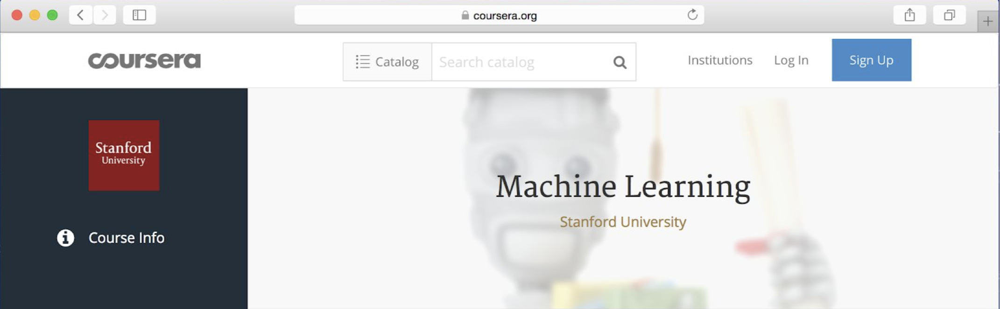

## 3 Prerequisites and Notation

Coursera MOOC 플랫폼에서 내가 진행한 머신러닝 코스를 들어본 적이 있거나, 지도학습을 적용해본 경험이 있다면, 이번 챕터가 말하고자 하는 것을 이해할 것이다. 이 책을 읽기에 앞서서, 지도 학습 (레이블이 붙은 트레이닝 예제를 (x,y)로 x -> y 로 매핑하는 함수를 학습하는 것) 이라는 개념과 친숙할 필요가 있다. 지도 학습 알고리즘은 Linear Regression, Logistic Regression, 그리고 인공신경망등을 포함한다. 다양한 형태의 머신러닝이 존재하지만, 오늘날의 대부분의 머신러닝의 실용적인 값어치는 지도 학습으로 부터 생겨났다.

이 책에서 나는 인공신경망 (딥 러닝이라고도 알려진) 에 대하여 자주 언급할 것이다. 깊은 지식까지는 필요 없지만, 이 책을 읽어 나가기 위해서 기본적인 이해가 필요하다. 만약, 위에서 말한 개념이 이해되지 않는 것이 있다면, Coursera의 [머신러닝 코스](​http://ml-class.org) 중 첫번째 3주간의 비디오를 시청하길 권장한다.

  

