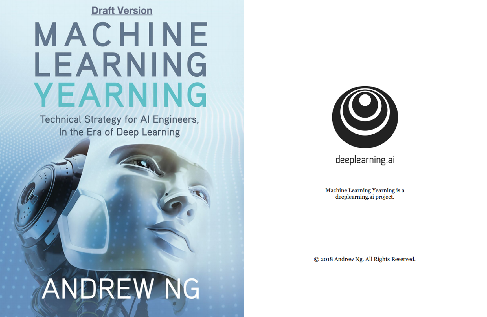

# 'Machine Learning Yearning' 책의 한국어 번역

이 저장소는 앤드류 응(Andrew Ng.) 교수저 'Machine Learning Yearning'라는 책의 한국어 번역 내용을 포함한다.

[번역 대상이 된 원서의 링크](https://l.facebook.com/l.php?u=https%3A%2F%2Fgallery.mailchimp.com%2Fdc3a7ef4d750c0abfc19202a3%2Ffiles%2Fd2dee348-4ada-400c-a0b2-d884fcdc368f%2FNg_MLY01_11.pdf&h=AT2Wn9gwIEnWhlRcmLMXMBx1pPSQzNZm4XjzvsdOaItRG7ukxC157YOhFLhAwMROsdMHWbs5XElHsXQRRTNJ748aXgE2adSWYLZOAcimsCEaH85nyagnPoQvh2kVpJL3MBoAyOY) 는 현재 집필중인 Draft 버전으로, 업데이트가 될 때 마다 해당 링크와 동기화 될 예정 입니다.

## Contents

[1 왜 머신러닝에 대한 전략을 알아야 하는가?](./chapters/1_Why_Machine_Learning_Strategy.md)

[2 이 책을 사용 하는 방법](./chapters/2_How_to_use_this_book_to_help_your_team.md)

[3 이 책을 읽기전 미리 알아야 하는 것과 사용되는 표기법](./chapters/3_Prerequisites_and_notation.md)

[4 규모가 머신러닝의 진보를 이끈다](./chapters/4_Scale_drives_machine_learning_progress.md)

### *개발용 데이터셋과 테스트용 데이터셋을 설정하는 것에 대하여*

[5 개발 데이터셋과 테스트 데이터셋](./chapters/5_Your_development_and_test_sets.md)

[6 개발/테스트 데이터셋은 같은 분포의 데이터로 구성되어야 한다](./chapters/6_Your_dev_and_test_sets_should_come_from_the_same_distribution.md)

[7 개발/테스트 데이터셋이 얼마나 커야 하는가?](./chapters/7_How_large_do_the_dev_test_sets_need_to_be.md)

[8 알고리즘 최적화를 위해서 단일-숫자 평가지표를 설정하는것](./chapters/8_Establish_a_single-number_evaluation_metric_for_your_team_to_optimize.md)

[9 최적화와 만족화라는 평가 지표에 대해서](./chapters/9_Optimizing_and_satisficing_metrics.md)

[10 개발 데이터셋과 평가지표로 개발 사이클 순환 속도를 빠르게](./chapters/10_Having_a_dev_set_and_metric_speeds_up_iterations.md)

[11 개발/테스트 데이터셋과 평가지표를 언제 바꿔야 하는가?](./chapters/11_When_to_change_dev_test_sets_and_metrics.md)

[12 요약: 개발 데이터셋과 테스트 데이터셋을 설정하는 것에 관하여](./chapters/12_Takeaways_Setting_up_development_and_test_sets.md)

### *기본적인 에러 분석에 대하여*

[13 빨리 시스템을 만들어 보고, 개발 사이클의 순환을 빠르게 하자](./chapters/13_Build_your_first_system_quickly_then_iterate.md)

[14 에러 분석: 아이디어에 대한 평가를 위해 개발 데이터셋을 살펴보는 것](./chapters/14_Error_analysis_Look_at_dev_set_examples_to_evaluate_ideas.md)

[15 에러 분석 중간에 여러가지 아이디어를 동시에 판단해 보는 것](./chapters/15_Evaluating_multiple_ideas_in_parallel_during_error_analysis.md)

[16 개발/테스트 데이터셋의 잘못 레이블링된 데이터를 정리하는 것](./chapters/16_Cleaning_up_mislabeled_dev_and_test_set_examples.md)

[17 큰 사이즈의 개발 데이터셋이 있는 경우, 두개의 부분집합으로 이를 나누고, 그 중 하나만 관찰하는 것](./chapters/17_If_you_have_a_large_dev_set_split_it_into_two_subsets_only_one_of_which_you_look_at.md)

[18 "눈알"과 "블랙박스" 개발데이터셋은 얼마나 커야 할까?]()

[19 요약: 기본적인 에러 분석에 관하여](./chapters/19_Takeaways_Basic_error_analysis.md)

### *편향과 분산에 대하여*

[20 편향과 분산: 에러를 일으키는 두 가지 큰 원인](./chapters/20_Bias_and_Variance_The_two_big_sources_of_error.md)

[21 편향과 분산의 예](./chapters/21_Examples_of_Bias_and_Variance.md)

[22 최적의 에러율과 비교하는 것](./chapters/22_Comparing_to_the_optimal_error_rate.md)

[23 편향과 분산 문제 해결방법에 대한 고심](./chapters/23_Addressing_Bias_and_Variance.md)

[24 편향 vs. 분산의 균형 대립](./chapters/24_Bias_vs_Variance_tradeoff.md)

[25 피할 수 있는 편향을 줄이기 위한 기법들](./chapters/25_Techniques_for_reducing_avoidable_bias.md)

[26 학습 데이터셋에 대한 에러 분석](./chapters/26_Error_analysis_on_the_training_set.md)

[27 분산치를 줄이기 위한 기법들](./chapters/27_Techniques_for_reducing_variance.md)

### *학습 곡선(Learning Curve)에 대하여*

[28 편향과 분산을 진단하는 것: 학습 곡선](./chapters/28_Diagnosing_bias_and_variance_Learning_curves.md)

[29 학습 데이터셋에 대한 에러의 곡선을 그리는 것](./chapters/29_Plotting_training_error.md)

30 Interpreting learning curves: High bias

31 Interpreting learning curves: Other cases

32 Plotting learning curves

### *인간 수준의 성능과 비교하는 것에 대하여*

33 Why we compare to human-level performance

34 How to define human-level performance

35 Surpassing human-level performance

### *다른 데이터 분포에 대하여 트레이닝과 테스트하는 것에 대하여*

36 When you should train and test on different distributions

37 How to decide whether to use all your data

38 How to decide whether to include inconsistent data

39 Weighting data

40 Generalizing from the training set to the dev set

41 Addressing Bias and Variance

42 Addressing data mismatch

43 Artificial data synthesis

### *추론 알고리즘을 디버깅 하는 것에 대하여*

44 The Optimization Verification test

45 General form of Optimization Verification test

46 Reinforcement learning example

### *End-to-End 딥러닝에 대하여*

47 The rise of end-to-end learning

48 More end-to-end learning examples

49 Pros and cons of end-to-end learning

50 Learned sub-components

51 Directly learning rich outputs

52 Error Analysis by Parts

53 Beyond supervised learning: What’s next?

54 Building a superhero team - Get your teammates to read this

55 Big picture

56 Credits
