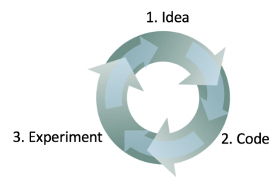

## 10. Having a dev set and metric speeds up iterations

새로운 문제에 직면했을때, 어떤 접근 방법이 가장 좋은지 미리 아는 것은 매우 어려운 일이다. 경험이 있는 머신러닝 연구자 또한, 일반적으로 어떤 만족할만한 결과를 발견하기 까지 수많은 아이디어를 시도할 것이다. 머신러닝 시스템을 만들때, 나는 보통 다음과 같은 프로세스를 수행한다.

***1. 어떻게 시스템을 만들것인지에 대한 몇가지 아이디어로 시작한다***

***2. 그 아이디어를 코드로 구현한다***

***3. 얼마나 그 아이디어가 잘 동작하는지 확인 가능한 수준으로 실험을 한다*** 
   - 일반적으로 첫번째 몇가지 아이디어는 잘 동작하지 않는다! 
   - 이 실험으로 부터, 뭔가에 대하 단서를 발견하게되고, 추가적인 아이디어를 더 만들어보는 반복을 수행한다.

  

위의 프로세스는 반복적인 프로세스이다. ***이 반복의 고리를 빠르게 돌수록, 더 빠른 결과를 얻을 수 있을 것*** 이다. 여기서 개발/테스트 데이터셋, 그리고 평가지표가 왜 중요한지를 알 수 있다
 - ***각 반복의 프로세스 단계에서 새로운 아이디어를 시험*** 하게 된다. ***개발 데이터셋은 그 아이디어의 성능을 측정*** 하여 올바른 방향으로 나아가고 있는지 아닌지 결정을 빠르게 내리는데 도움을 줄 수 있다.

이와는 대조적으로, 정해진 개발 데이터셋과 평가지표가 아직 없다고 가정해 보자. 각각의 반복의 프로세스 단계에서 새로운 분류 알고리즘이 개발 될 수 있다. 개발된 분류 알고리즘은 개발중인 어플과 함께 연동하여 동작해 봐야 할 것이고, 새로운 알고리즘의 성능이 향상 되었는지 알아보기 위해서 해당 어플을 몇시간정도 테스트 해 봐야 할 것이다. 이 경우에, 꽤나 느린 진행률을 얻게 될 것이다! 또한, 만약에 알고리즘의 정확도를 95.0%에서 95.1%로 향상시키고 싶다면, 0.1%의 향상을 어플을 테스트 하는동안 알아채기는 것은 사실상 불가능하다 (물론, 아주 천천히 0.1%이라는 향상 목표를 향해서 수 많은 시도를 통해 어떤 진전이 있을지도 모른다). ***개발 데이터셋과 평가지표는 어떤 아이디어가 가장 성공적인지 빠르게 알 수 있도록 도와준다.*** 그렇기 때문에, ***어떤 아이디어를 더 정제*** 해야하고 ***어떤 아이디어를 버려야 하는지*** ***빠르게 결정*** 할 수 있다.
