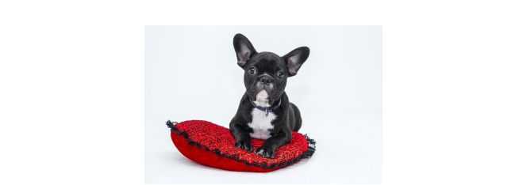

## 14 Error analysis: Look at dev set examples to evaluate ideas

  

앞서 언급되어온 고양이 분류 어플에 대해서 실험할때, 강아지를 고양이로 잘못 분류하는 몇가지 경우가 있다는 것을 발견할지도 모른다. (몇몇 개들은 실제로 고양이 처럼 보이는 경우도 있다!)

팀 구성원 중 한명이 강아지 이미지에 대해서 더 좋은 결과를 보여주는 써드파티 소프트웨어와 협력하기를 제안할지도 모른다. 이러한 변화는 한달 이상의 시간이 걸릴 지도 모르지만, 그 팀 구성원은 아주 열정적이다. 이때, 그렇게 하라고 말해주어야 할까?

한달 이라는 ***시간을 이 작업에 투자하기 전에*** , ***우선*** 은 그 작업으로 인해서 시스템의 ***정확도가 얼마나 향상될지를 예측해 보는 작업을 추천*** 해주고 싶다. 그러고 나면, 이 작업이 한달이나 개발 시간을 쓰는 것에 의미가 있는지 좀 더 합리적으로 판단할 수 있다. 그렇지 않다면, 그 시간을 다른 곳이 투자하는 것이 더 좋기 때문이다.

좀 더 구체적으로, 무엇을 해야할지 논의해 보자

**1. 현재 시스템이 잘못 분류하는(에러가 발생된) 100개의 예제 개발 데이터셋 를 구해보자.**

**2. 이 데이터셋을 일일이 수작업으로 한번 들여다 보자, 100개 중 몇 퍼센트나 강아지 이미지가 있는지 세어보자.**

잘못 분류된 예제 데이터를 들여다 보는 작업은 ***"에러 분석"*** 이라고 불린다. 이 예제에서, 단지 잘못 분류된 전체 이미지의 5%만이 강아지 이미지라는 것을 발견 했다면, 강아지 이미지에 대해서 알고리즘의 성능을 향상시켜 봤자 그 5% 에러를 해결하는 것은 어려울 것이다. 다시 말해서, 5%는 마지노선 (최대로 가능한 수준) 이라고 볼 수 있다. 따라서, 만약 전체 시스템이 현재 90%의 정확도 (10%의 에러)를 가지고 있는 경우, 이 강아지 이미지에 대한 개선작업은 정확도 향상에 고작 90.5% 까지밖에 기여하지 못한다. (최초 10%의 에러율보다 5% 줄어든 9.5%의 에러로 인하여)

이와 대조적으로, 만약 50%의 실수가 강아지 이미지였다면, 제안된 서드파티 소프트웨어와의 협력은 프로젝트에 아주 큰 영향을 줄 수 있을 것이라는데 의심할 여지가 없다. 현재의 90% 정확도를 95%까지 끌어올릴 수 있을 것이다. (에러를 50% 감소하여, 이는 최초 10%에러를 5%까지 줄이는 것을 의미)

위에 소개된 에러 분석에 대하여 간단히 ***"직접 손으로 세어보는" 과정*** 이 써드파티 소프트웨어와 협력하는 것이 가져오는 잠재적인 가치의 빠른 측정을 할 수 있게 해준다. 이 방법은 투자할 가치가 있는지 없는지 결정하기 위한 기본이 되는 정량치를 알 수 있게 해 준다.

***"에러 분석"*** 은 다른 ***문제 해결의 방향들이 얼마나 유망한지 알아내는데 도움*** 을 주기도 한다. ***"에러 분석"*** 을 시행하는것을 꺼려하는 수 많은 엔지니어를 봐 왔다. 아마도, 몇몇 아이디어를 생각해 내고 이를 구현하는데 직접 뛰어드는 것이, 그 아이디어가 얼마나 가치 있는지에 대하여 질문을 던지는데 시간을 사용하는 것보다 흥미롭기 때문일 것이다. 그러나 이건 아주 일반적인 실수이다.

수작업으로 100개의 예제를 관찰해 보는 것은 그다지 시간이 걸리지 않는다. 하나의 이미지당 1분을 소요한다고 가정해도 2시간 이내에 작업을 완료할 수 있다. 이 2시간은 쓸데 없는 노력으로 허비되는 1달을 절약하는데 도움을 줄 수 있다.

***"에러 분석"*** 은 작성된 알고리즘이 잘못 분류한 개발 데이터셋의 ***일부 예제를 관찰해 보는 과정*** 으로, ***에러를 유발하는 기본적인 원인을 이해하는데 도움*** 을 준다. 프로젝트를 이끌어 나가는 여러가지 제안된 방향들 중 우선순위를 매길 수 있게 도와준다. 다음 몇몇 챕터들은 에러 분석을 수행하기 위한 최고의 실전 방법을 소개한다.
