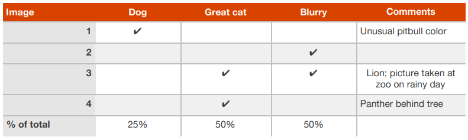
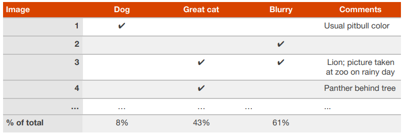

## 15 Evaluating multiple ideas in parallel during error analysis

당신과 당신의 팀이 고양이 분류 알고리즘을 향상하기 위해, 다음과 같은 몇가지 아이디어가 있을 수 있다.

**- 강아지를 고양이로 인식하는 알고리즘의 문제점을 고치는 것**

**- 큰 고양잇과의 동물(사자, 팬서, 등등..)을 애완용 집고양이로 인식하는 알고리즘의 문제점을 고치는 것**

**- 흐릿한 이미지에 대하여 시스템 성능을 향상 시키는 것**

**- ...**

위에 나열된 모든 아이디어를 동시에 효율적으로 평가해 볼 수 있을 것이다. 나는 보통 100개 까지의 잘못 분류된 개발 데이터셋을 보면서, 그 예제 데이터를 스프레드 시트에 기록하곤 한다. 그리고, 특정 중요한 예제 데이터에 대해서는 약간의 코멘트를 남기기도 한다. 다음 네 개의 예제 데이터로 구성된 작은 개발 데이터셋에 대한 스프레드 시트를 살펴 보면서, 내가 수행하는 과정을 설명해 보겠다.  

  

위 스프레드 시트에서, 세 번째 열의 예제 데이터(이미지)는 "큰 고양잇과의 동물"과 "흐릿함" 이라는 행에 대하여 체크되어 있다. 또한, 하나의 예제 데이터(이미지)는 여러 에러 종류(행)와 연관될 수 있다. 따라서, 각 행의 마지막 열에 기록되는 합산된 비율값은 100%가 아닐 수도 있게 된다.

"강아지", "큰 고양잇과의 동물", "흐릿함" 이라는 에러 종류를 먼저 구성 한 후, 예제 데이터(이미지)들을 수작업으로 분류해 볼 수 있을지도 모른다. 하지만, 현실적으로 예제 데이터(이미지)를 확인하는 순간 새로운 에러 종류를 추가적으로 제안하게 될 가능성이 크다. 한가지 예를 들어보자. 열 두장의 이미지를 관찰하는 도중에 인스타그램의 필터 기능이 적용된 사진들에 대해서, 알고리즘의 많은 실수가 발생했다는 것을 알게 될 수 있다. 이 때는 다시 처음 과정으로 돌아가서, "인스타그램" 이라는 새로운 행을 추가할 수 있다. 알고리즘이 잘못 분류한 예제 이미지를 일일이 수작업으로 관찰 해보고, 사람이라면 그 이미지를 어떻게 올바르게 레이블링 할 수 있는지에 대한 질문을 해보자. 이는 새로운 에러 종류를 생각해 낼 수 있게 해주고, 그것에 대한 해결책도 찾을 수 있게 해 줄 것이다.

***가장 도움이 되는 에러 종류는, 성능 향상에 대한 방법이 이미 존재하는 것일 수 있다.*** 인스타그램 에러 예제에서, 인스타그램 필터가 적용된 사진을 원본으로 되돌릴 수 있는 방법을 알고 있다면, 인스타그램이라는 에러 종류는 추가하면 큰 도움이 되는 것이라고 볼 수 있다. 하지만, 성능을 향상 시킬는 방법을  아는 것에 대해서만, 에러 종류로 추가해야 한다고 제한하지는 말자. 집중을 해야하는 가장 유망한 부분이 무엇인지에 대한 직관력을 키우는 것이 이 과정의 목표라고 볼 수 있다.

***에러 분석은 반복적인 작업이다.*** 어떤 카테고리를 사용해야 하는지 생각나는 것이 없더라도 걱정할 필요는 없다. 몇가지 예제 데이터(이미지)를 관찰하고 나면, 에러 종류에 대한 약간의 아이디어를 얻게 될 것이다. 몇가지 예제 데이터(이미지)에 대한 에러 종류를 각 에러 종류에 맞게 수작업으로 분류한 후, 새로운 에러 종류를 설정하고 이를 고려하여 예제 데이터(이미지)를 다시 분석할 수도 있다. 이런 식으로 에러 종류에 대한 아이디어를 얻어 나갈 수 있을 것이다.

100개의 잘못 분류된 개발 데이터셋의 예제 데이터(이미지)에 대한 에러 분석을 끝낸 후, 아래와 같은 결과를 얻었다고 가정해 보자.

  

"강아지" 에러를 개선하기 위해 프로젝트를 진행 했을때, 최대 8%의 에러를 제거(개선) 가능 하다는 것을 알 수 있다. "큰 고양잇과의 동물" 또는 "흐릿한"  에러에 대한 개선은 "강아지" 에러를 개선하는 것 보다, 더 많은 개선에 도움을 줄 수 있다. 그러므로 후자로 언급된 두 가지의 에러 종류에 좀 더 집중하여  프로젝트의 진행방향에 대한 결정을 내릴 수 있게 된다. 소속된 팀 구성원이 많아서 동시에 여러 개선 방향을 시도해 볼 수 있다면, 몇 엔지니어에게는 "큰 고양잇과의 동물"에 관련된 에러를, 다른 몇 엔지니어에게는 "흐릿한"에 관련된 에러를 개선하도록 요청할 수도 있다.

에러 분석에서 가장 높은 우선순위가 무엇인지 바로 알 수 있는 어떤 정확한 수학적인 공식이라는 것은 없다. 우선순위를 정하기 위해서는 각각의 에러 종류에 대한 개선이 얼마나 많은 프로젝트의 진척을 이뤄 낼 수 있는지, 얼마나 많은 시간이 필요한지에 대하여 생각해야만 한다.
