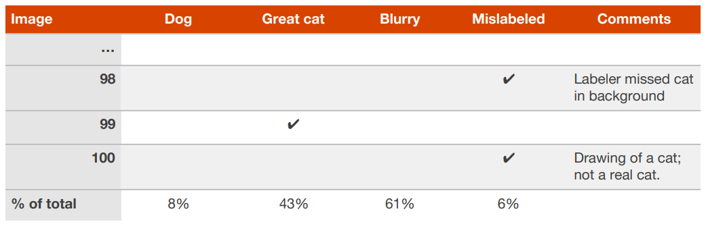

## 16 Cleaning up mislabeled dev and test set examples

에러 분석 도중에 개발 데이터셋에 있는 몇몇 예제 데이터들이 잘못 레이블링 된 것을 발견하는 경우가 있다. "잘못 레이블링된" 이라는 이야기는, 알고리즘이 이 문제에 직면하기도 전에 이미 사람이 잘못된 레이블 기입한 경우를 말한다. 예를 들어서, (x, y) 라는 예제 데이터에서 y 값이 잘못 기입된 것이다. 또 다른 예로, 몇몇 고양이가 아닌 사진들이 고양이다 라고 잘못 레이블링된 경우나, 그 반대의 경우를 생각해 볼 수 있다. 잘못 레이블링된 이미지들의 부분집합이 매우 중요하다고 생각된다면, 다음과 같이 그 잘못 레이블링된 예제 데이터를 추적하기 위한 카테고리를 추가해 보자:

  

개발 데이터셋에 있는 레이블들을 올바르게 수정해야만 할까? 개발 데이터셋의 목표점은 알고리즘 A가 B보다 더 낫다고 빠르게 판단을 내릴 수 있는데 도움을 주는 것임을 상기하자. 잘못 레이블링된 개발 데이터셋의 일부분이 이런 판단을 내리는 것을 지연시키고 있다면, 이 잘못 레이블링된 값을 올바르게 수정하는데 드는 시간은 의미가 있을 것이다.

예를 들어서, 당신이 만든 분류기의 성능이 다음과 같다고 가정해 보자:
- 개발 데이터셋에 대한 종합적인 정확도 ........ 90% (10%의 종합적인 에러율)
- 잘못 레이블링된 데이터로 야기된 에러율 ...... 0.6% (개발 데이터셋에서의 6%의 에러율)
- 그 외의 원인으로 야기된 에러율 ............. 9.4% (개발 데이터셋에서의 94%의 에러율)

잘못 레이블링된 데이터로 야기되는 0.6% 라는 부정확성은 비교적 그다지 중요하지 않을 수 있다. 왜냐하면 상대적으로 그 외의 원인을 조사하여 9.4%라는 에러율을 개선 할 수 있을지도 모르기 때문이다. 개발 데이터셋에서 잘못 레이블링된 데이터를 수작업으로 올바른 값으로 수정하는 것이 해롭지는 않다. 그러나 그 작업이 크게 중요하지도 않다. 전체 시스템의 에러율이 10%인 것과 9.4%인 것에 대한 차이를 아는게 크게 중요하지 않는 경우에 그렇다는 말이다.

고양이 분류 알고리즘을 계속 개선하여, 다음과 같은 성능을 얻었다고 가정해 보자:
- 개발 데이터셋에 대한 종합적인 정확도 ........ 98.0% (2.0%의 종합적인 에러율)
- 잘못 레이블링된 데이터로 야기된 에러율 ...... 0.6% (개발 데이터셋에서의 30%의 에러율)
- 그 외의 원인으로 야기된 에러율 ............. 1.4% (개발 데이터셋에서의 70%의 에러율)

30%에 해당하는 에러율이 개발 데이터셋에 있는 잘못 레이블링된 이미지로 부터 야기 되었다. 이는 정확도를 측정에 대한 중대한 에러율이라고 볼 수 있다. 이 경우에는 개발 데이터셋에 있는 레이블들의 질(퀄리티)를 향상시키는 것이 의미 있는 일이 된다. 잘못 레이블링된 예제 데이터를 건드리는 것은 분류 알고리즘의 에러율이 1.4%, 2.0% 둘 중 어느쪽에 더 가까운지 알아내는데 도움을 줄 것이다. 이 경우에 1.4%냐 2.0%냐는 상대적으로 중요한 차이라고 볼 수 있겠다.

잘못 레이블링된 개발/테스트 데이터셋을 용인하면서 시작하는것은 일반적이다. 하지만, 시스템의 성능이 향상됨에 따라서, 잘못 레이블링된 데이터로 야기되는 에러율이 차지하는 비율이 커질 수 있다. 그러므로, 시스템이 성장함에 따라 이를 염두해 두는 것이 좋다. 

마지막 챕터가 강아지, 거대한 고양이과, 흐릿한 이미지등의 잘못된 카테고리로 야기되는 에러율을 어떻게 알고리즘적으로 개선할 수 있는지에 대하여 설명 할 것이다. 이번 챕터에서는 잘못 레이블링된 카테고리에 대해서 데이터의 레이블을 개선시키는 것 처럼 어떤 작업을 해야 하는지를 배웠다. 

개발 데이터셋의 레이블을 고치기 위한 과정이 무엇이든지 간에, 이를 테스트 데이터셋에도 동일하게 적용해야 함을 기억해 두자. 그래야 개발/테스트 데이터셋이 동일한 데이터 분포를 가지게 된다. 개발/테스트 데이터셋을 함께 수정하는 것이 챕터6에서 논의된 문제를 방지할 수 있을 것이다. 

레이블의 질(퀄리티)를 향상 하고자 마음 먹었다면, 시스템이 잘못 분류한 예제 데이터와 잘 분류한 예제 데이터의 레이블을 함께 체크해 보기를 권장한다. 수정전의 레이블과 알고리즘이 모두 그 특정 예제 데이터에 대해서 잘못되어 있을 가능성이 있기 때문이다. 만약 시스템이 잘못 분류한 데이터의 레이블만을 수정한다면, 이후 평가 단계에서 편향된 결과를 얻을 수도 있다. 1,000개로 이루어진 개발 데이터셋을 가지고 있을때, 그리고 작성된 알고리즘이 98.0%의 정확도를 보일때, 20개의 잘못 분류된 데이터를 분석해 보는 것이 나머지 잘 분류된 980개의 데이터를 분석하는 것 보다 쉽다. 왜냐하면, 현실적으로 잘못 분류된 데이터를 체크해 보는 것이 더 쉽다. 이 경우에, 편향된 결과가 몇몇 개발 데이터셋에 발생하게 된다. 이 편향된 결과는 상품/어플리케이션을 개발하는 것에만 관심이 있는 경우 괜찮을 수 있다. 하지만, 아카데믹한 연구 논문에 사용되거나 테스트 데이터셋의 정확도의 완전히 편파적이지 않은 측정을 하고 싶을때는 문제가 될 수 있다.
