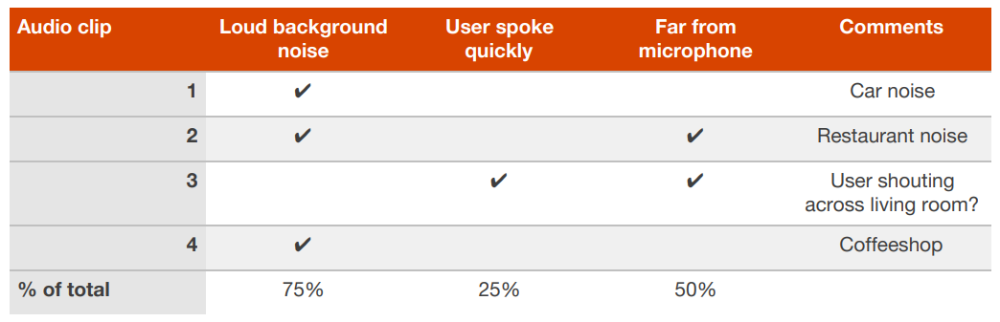

## 26 Error analysis on the training set
추가적으로
개발된 알고리즘이 개발 및 테스트 데이터셋에서 잘 동작하기를 원하기 전에, 먼저 학습 데이터세을 대상으로 잘 동작 해야만 한다.

앞에서 언급된 높은 ***`편향`*** 의 해결 기법 외에, 나는 학습 데이터셋에 대하여, 눈알 데이터셋에 대한 에러분석과 비슷한 절차의 에러분석을 추가로 실시할 때가 있다. 이런 행위는 알고리즘이 (학습 데이터셋에서 잘 동작하지 못하는) 높은 ***`편향`*** 을 보일때 유용할 수 있다.

예를 들어 보자. 어떤 앱에 들어가는 음성 인식 시스템을 개발 했는데, 학습 데이터 수집에 자원자들이 녹음한 오디오 클립을 활용 했다고 가정해 보자. 이 시스템이 학습 데이터셋에 대해서 잘 동작하지 못한다면, 에러의 원인이되는 주된 분류 기준에 포함되는 ~100개 정도의 샘플 데이터를 직접 들어보는 과정을 수행해 볼 수 있을 것이다. 개발 데이터셋에 대한 에러 분석과 유사하게, 다른 분류 기준에 대한 에러를 세어볼 수도 있다.

  

위 차트에서, 배경 노이즈가 많이 섞인 학습 데이터셋에 대해서 알고리즘이 특히나 어려움을 겪는 것을 알 수 있다. 이런 분석이 이루어지면, 배경 노이즈를 가진 학습 데이터에 더 잘 들어맞도록 해 주는 기법에 좀 더 촛점을 맞출 수 있게 된다.

학습 알고리즘에 사용된 동일한 오디오 클립을 실제 사람에게 주고, 이를 음성 기호로 표기할 수 있는지를 확인해 봐서 결과의 재확인을 해볼 수도 있다. 아주 많은 배경 노이즈가 있어서, 그 누구도 무슨말인지 알아듣기 힘든 상황이라면, 그 말을 정확히 인식하기 위한 알고리즘이 완성되길 기대하는 것은 불합리하다고 판단할 수도 있다. 개발하는 알고리즘과, 사람-수준의 성능을 비교하여 얻을 수 있는 이점에 대해서는 이후 챕터에서 좀 더 다뤄질 예정이다.
