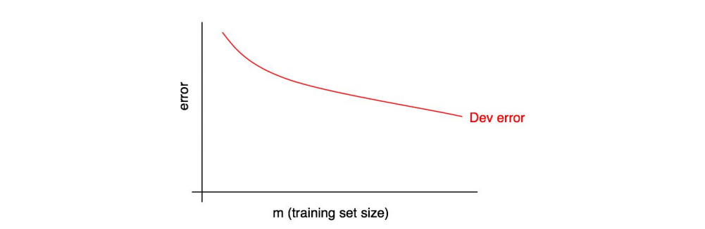
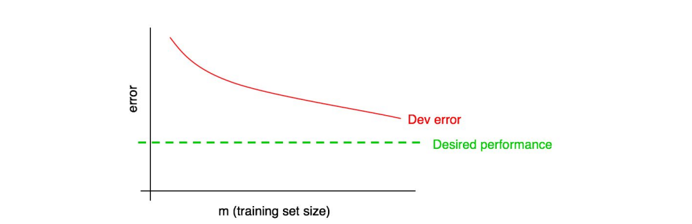
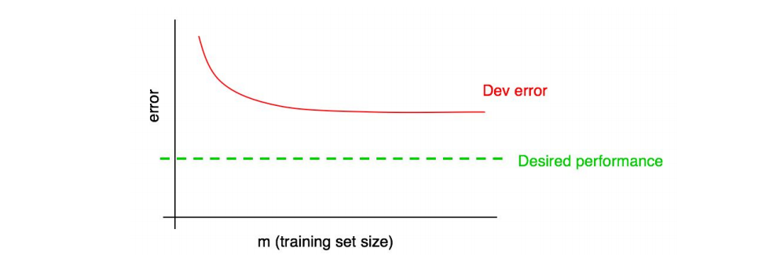

## 28 Diagnosing bias and variance: Learning curves

앞서 얼마나 많은 에러가 피할 수 있는 편향과 분산의 균형대립에의한 것인지를 측정하는 몇가지 방법으로 최적의 에러율을 측정하고 알고리즘의 학습 데이터셋과 개발 데이터셋에 대한 에러를 계산하는 것에 대하여 알아 보았다. 이번에는 좀 더 유익한 기법에 대하여 이야기 해보고자 한다: 학습 곡선 그림을 그려보는 것

학습 곡선은 학습데이터의 양(x축)에 대비한 개발 데이터셋에 대한 에러(y축)를 표현한다. 이 그림을 그려내기 위해서, 서로다른 크기를 가지는 학습 데이터셋들을 사용해서 알고리즘을 수행해 봐야 한다. 예를 들어서 1,000개의 데이터가 있는 경우에, 100, 200, 300, ..., 1000개로 구성되는 여러개의 데이터셋으로 복사하고 분리하여 알고리즘의 학습을 수행해 볼 수 있다. 그러고 나면 개발 데이터셋에 대한 에러가 다른 크기의 학습 데이터셋에 따라서 얼마나 변화하는지를 그려낼 수 있다. 아래에 한가지 예를 보여주면:

  

학습 데이터셋의 크기가 증가함에 따라서, 개발 데이터셋에 대한 에러도 증가해야하만 한다.

우리는 종종 학습 알고리즘이 결과적으로 성취하기를 희망하는 "희망하는 에러율"을 정의하게 된다. 예를들어서:

- 만약 사람-수준의 성능을 희망한다면, 사람 수준의 에러율이 "희망하는 에러율"이 될 것이다.

- 만약 학습 알고리즘이 몇몇 상품에 적용되면, 어떤 정도의 성능이 사용자들에게 뛰어난 경험을 제공할 수 있는지를 직관적으로 알아차릴 수 있을 것이다.

- 만약 오랜시간동안 하나의 중요한 어플리케이션의 개발에 매진하는 경우, 1년 또는 4개월동안 얼마나 많은 성과를 만들어낼 수 있느지를 직관적으로 알아차릴 수 있을 것이다.

앞서 작성된 학습곡선에 희망하는 수준의 성능을 추가해 보자:

  

시각적으로 얼마나 더 많은 데이터를 추가하면, 빨간 "개발 에러" 곡선이 희망하는 수준의 성능을 보여주는 곡선에 더 가까워지는지 추론해 볼 수 있다. 위 예제에서는, 학습 데이터셋의 크기를 두배로 증가시키면 희망하는 수준의 성능까지 도달하는게 가능해 보인다.

하지만, 만약 개발 에러 곡선이 "고원(평평)"의 모양을 띈다면, 더 많은 데이터를 추가해 봤자 목적하는 것을 이룰 수 없다는 것을 즉각적으로 깨닳을 수 있게 된다.

  

학습 곡선을 관찰은 학습데이터를 더 크게 구성하기 위해서 수개월 동안 데이터를 모으는 행위가 문제 해결에 도움이 되는지, 그렇지 않은지를 깨닳는데 도움을 준다.

이 방법(과정)의 한가지 단점은 개발 에러 곡선만을 관찰하게 되는 경우, 더 많은 데이터를 모았을때 빨간 곡선이 정확히 어디에 위치될지를 예측하고 추론하는 것이 어렵다는 점이다. 더 많은 데이터를 수집하는것의 영향에 대한 측정을 돕기위해서 한가지 추가적인 그래프가 있고, 그것은 학습 에러 곡선이다.