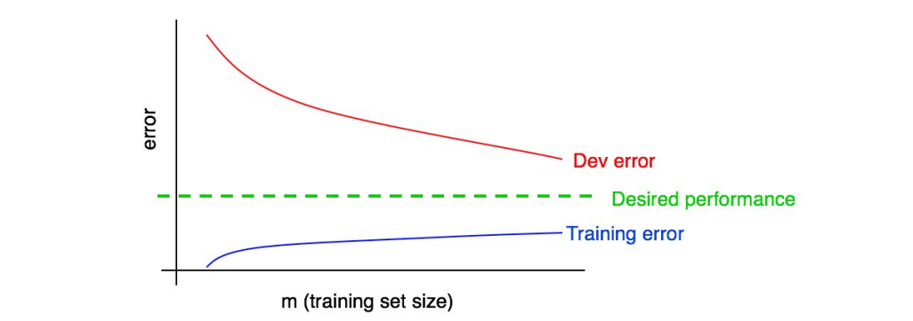

## 29 Plotting training error

개발 데이터셋 (그리고 테스트 데이터셋)에 대한 에러는 학습 데이터셋의 크기가 증가함에 따라 감소 되어야만 한다. 하지만, 학습 데이터셋에 대한 에러는 일반적으로 학습 데이터셋의 크기가 증가함에 따라 증가하게 된다.

예를 들어서 이 영향에 대한 묘사를 해보자. 학습 데이터셋이 단 2개의 데이터로만 구성되어 있다고 가정해 보자: 하나는 고양이 이미지고, 나머지는 고양이가 아닌 이미지이다. 그러면, 학습 알고리즘이 학습에게 데이터셋에 있는 두개의 데이터를 "기억하는것"은 쉬운 일이다. 그리고 결과적으로 학습 데이터셋에 대한 0%의 에러를 얻게 된다. 그 두 개의 데이터가 잘못 레이블링 된 경우도 마찬가지로, 알고리즘이 그 레이블을 기억하기란 쉬운 일이다.

그러면 이제 학습 데이터셋이 100개의 데이터로 구성되어 있다고 가정해 보자. 아마도 그 중 몇몇은 잘못 레이블링 되었거나, 모호하게 레이블링 되어 있을 수도 있다 (이미지가 흐릿하거나 등의 이유로, 사람조차도 이를 구분하기 어려운 경우). 아마도 학습 알고리즘은 여전히 학습 데이터셋에 있는 모든 거의 대부분의 데이터를 "기억하는것"이 가능할 것이다. 하지만, 이제는 100%라는 정확도를 얻는것이 이전보다는 더 어려워 졌다. 학습 데이터셋의 데이터 양을 2에서 100으로 증가 시킴으로써, 학습 데이터셋에 대한 정확도가 미세하지만 약간 떨어지게 되는 현상을 목격할 수 있을 것이다.

마지막으로, 학습 데이터셋이 10,000개의 데이터로 구성되어 있다고 가정해 보자. 이 경우에는 10,000의 모든 데이터에 대해서 알고리즘이 완벽하게 들어 맞게 되기란 더욱더 어려워 진다. 특히나, 몇몇 모호하거나 잘못 레이블링된 데이터가 존재하면 더욱 그렇다. 그렇기 때문에, 학습 알고리즘은 학습 데이터셋에 대해서 더 안좋은 성능을 보여주게 된다.

다음과 같이 앞서 그려진 그래프에 학습 에러 곡선을 추가해 보자:

  

파란색 "학습 에러" 곡선이 학습 데이터셋의 크기와 함께 증가하는 것을 알 수 있을 것이다. 더욱이, 알고리즘은 보통 개발 데이터셋에서 보다는 학습 데이터셋에 대하여 더 잘 동작한다; 그러므로 빨간색(개발 에러) 곡선은 통상적으로 파란색(학습 에러)곡선 보다 위쪽에 위치하게 된다.

다음 챕터는 이 곡선들을 해석하는 방법을 다룬다.