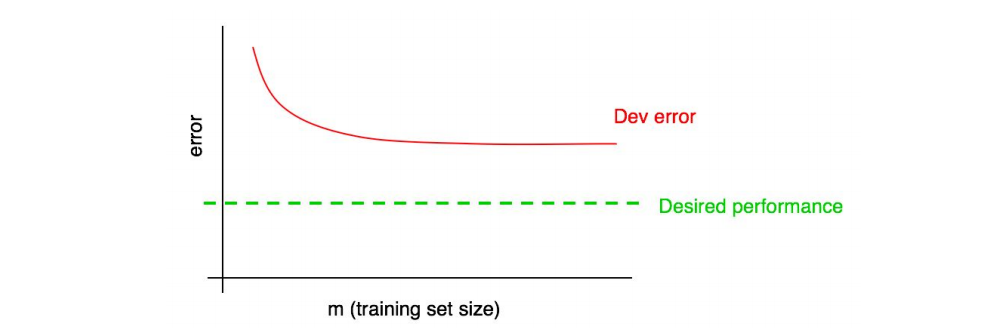
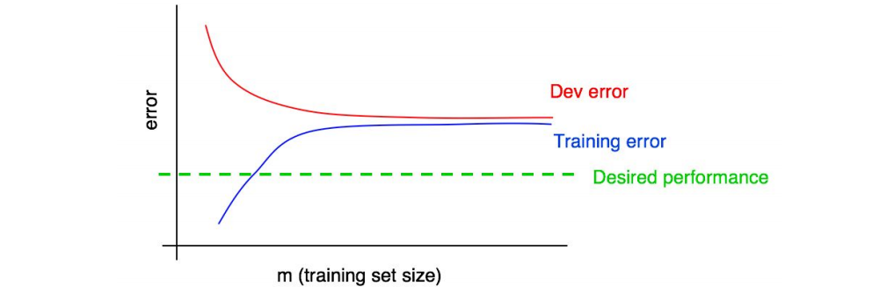

## 30 Interpreting learning curves: High bias

개발 에러 곡선이 다음과 같은 형태를 보인다고 가정해 보자:

  

앞서 말한 것 처럼, 개발 에러 곡선이 고원(평지)를 이루는 경우, 더 많은 데이터를 추가해 봤자 희망하는 성능을 성취하는 것이 어렵다.

그러나, 빨간 개발 에러 곡선을 추론하는 것이 의미하는 바를 정확히 아는 것은 어려워 보인다. 만약 개발 데이터셋의 크기가 작다면, 곡선이 매끄럽지 못하게 되므로 어떤 확신을 가지기가 더 어려워 진다.

학습 에러 곡선을 다음과 같이 추가해 보는 것을 가정해 보자:

  

이제는 더 많은 데이터를 추가하는 행위 그 자체가 충분하지 않다는 것에 완전한 확신을 가질 수 있을 것이다. 왜 그런가? 두 가지 분석을 기억해 내어 보자:

- 더 많은 학습 데이터를 추가함에 따라서, 학습 에러만이 더 나빠지게 된다. 그렇기 때문에, 파란색 학습 에러 곡선은 그대로거나 더 위로 올라가게 된다. 이것은 희망하는 레벨의 성능 (초록색) 으로 부터 더 멀어지는 것을 의미한다.

- 빨간색 개발 에러 곡선은 보통 파란색 학습 에러보다 높이 위치한다. 그렇기 때문에, 학습 에러가 희망하는 레벨의 성능보다 더 높은 곳에 위치할때, 더 많은 데이터를 추가하는 것이 개발 에러 곡선을 (희망하는 레벨의 성능 쪽인) 아래로 떨어트리는 것은 거의 불가능 하다.

동일한 그래프상에서 개발 에러 곡선과 학습 에러 곡선을 관찰해 보면, 개발 에러 곡선에 대한 추론(추측)을 좀 더 확신을 가지고 할 수 있게 해준다.

희망하는 성능이 최적의 에러율의 추정치라고 가정해 보자. 그렇다면, 위의 그래프는 높은 피할 수 있는 편향이 어떻게 생겼는지에 대한 학습 곡선의 "교과서 적인" 표준 예제가 된다: 학습 데이터셋의 크기가 가장 큰 시점에, 학습 에러와 희망하는 성능치 사이에는 커다란 피할 수 있는 편향을 나타내는 커다란 격차가 존재한다. 더욱이, 학습 에러 곡선과 개발 에러 곡선의 격차는 작은데, 이는 작은 분산을 의미한다.

앞서서, 개발 데이터셋에 대한 에러와 학습 데이터셋에 대한 에러를, 사용 가능한 모든 학습 데이터를 모두 사용하는 지점인 이 그래프의 가장 오른쪽의 위치에서 측정했었다. 완전한 법위의 학습 곡선을 그려보면 다른 학습 데이터셋의 크기에 따른 알고리즘의 성능에 대한 좀더 포괄적인 그림을 얻을 수 있다.