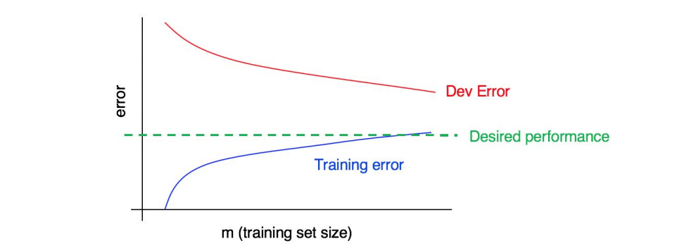

## 31 Interpreting learning curves: Other cases

다음과 같은 학습 곡선을 고려해보자:

  

위 그래프가 높은 편향을 나타내는가? 높은 분산을 나타내는가? 아니면 두개 다를 나타내는가?

파란색 학습 에러 곡선은 비교적 아래에 위치하고, 빨간색 개발 에러 곡선은 파란색에 비해서 훨씬 더 위쪽에 위치한다. 그렇기 때문에, 편향치는 작지만 분산치는 크다고 볼 수 있다. 더 많은 학습 데이터를 추가하면, 개발 에러와 학습 에러 사이의 격차를 좁히는데 도움이 될 것이다.

이번에는 아래의 곡석을 고려해보자:

  

이번에는 학습 에러가 크다. 얼마나 크냐하면 희망하는 수준의 성능보다 훨씬 더 위쪽에 위치한다. 개발 에러는 학습 에러보다도 훨씬 크다. 그렇기 때문에, 아주 중대한 크기의 편향치와 분산치가 나타난다. 알고리즘의 편향치와 분산치를 모두 줄이기 위한 방법을 찾아야만 할 것이다.