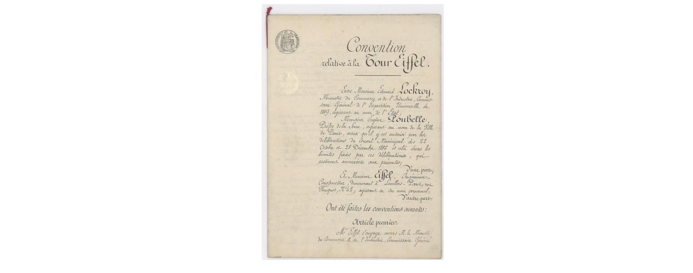

## 37 How to decide whether to use all your data

고양이 인식 알고리즘의 학습 데이터셋이 사용자가 업로드한 10,000장의 이미지를 포함한다고 가정해 보자. 이 데이터들은 분리된 개발/테스트 데이터셋 으로서 동일한 분포로 부터 구성된다. 그리고, 이 데이터들은 개발하는 앱이 잘 동작되길 원하는 분포를 나타낸다. 한편, 추가적인 20,000장의 이미지도 인터넷으로 부터 다운받아 두었다. 20,000 + 10,000 = 30,000장의 모든 이미지를 학습 알고리즘에게 학습 데이터로서 제공해야 할까? 아니면, 학습 알고리즘에 편향성이 발생하는 것이 두려워서 인터넷에서 다운받은 20,000장의 이미지를 버려야 할까?

(직선으로 분류하는 알고리즘에 사용되는 사람의 손으로 디자인된 컴퓨터 비전을 위한 feature과 같은)초창기 세대의 학습 알고리즘이 사용 되었을때, 이 두가지 데이터 타입을 병합 하는데에는 성능을 저하시키는 위험성이 존재하였다. 그렇기 때문에, 몇몇 기술자들은 20,000장의 인터넷에서 다운로드된 이미지를 학습 데이터에 포함시키는 행위에 대해서 경고를 할 것이다. 

하지만, 현대의 강력하고 유연한 학습 알고리즘들(예를 들어서 거대한 뉴럴넷) 은 이러한 위험성을 크게 감소시킬 수 있었다. 큰 수의 히든 유닛/레이어로 구성된 뉴럴넷을 수용할 수 있는 환경이 갖추어져 있다면, 그 20,000장의 이미지를 학습 데이터에 안전하게 포함시키는 것이 가능하다. 이미지를 포함시키게 되면, 성능이 향상될 확률이 더 커진다고 볼 수 있다.

이러한 의견은 두 가지 종류의 데이터에 대해서 모두 잘 동작하는 x 에서 y로 매핑이 존재한다는 사실에 기반한다. 다시 말해 보자면, 인터넷에서 다운로드된 이미지 또는 앱에 업로드된 이미지를 인풋 데이터로 받아들이고, 더욱이 인풋으로 들어오는 이미지의 출처가 무엇인지 조차 알 필요가 없는 상태에서 안정적으로 레이블을 예측하는 시스템이 존재 한다는 이야기다.

추가적인 20,000장의 이미지를 추가하면, 다음과 같은 효과가 발생한다:

1. 고양이가 어떻게 생겼는지, 어떻게 생긴 것이 고양이가 아닌지에 대한 더 많은 예제 데이터를 뉴럴넷에 공급해준다. 인터넷 이미지와 사용자가 업로드한 이미지는 몇몇 유사성을 공유할 수 있기 때문에, 이는 도움이 된다고 볼 수 있다. 뉴럴넷은 인터넷 이미지로 부터 학습한 어떤 지능을, 사용자가 업로드한 이미지에 적용할 수 있는 능력이 있다.

2. (고화질, 이미지의 다른 종류의 프레임등과 같은) 인터넷 이미지에 특정된 속성을 학습하기 위한 뉴럴넷의 능력 확장을 강제한다. 이러한 속성이 사용자가 업로드한 이미지와 아주 많이 다른 경우, 이를 표현하기 위한 뉴럴넷의 능력(용량)은 고갈 될 것이다. 그러므로, 사용자가 업로드한 이미지 분포의 데이터를 인식하기 위한 용량이 상대적으로 부족하게 된다. 이론적으로 보면, 이는 알고리즘의 성능에 해가 된다.

두번째로 소개된 효과를 다른 방식으로 설명해 보겠다. 당신의 뇌가 유한한 공간을 가지는 다락방과 같다고 말한 소설속의 캐릭터, 셜럭 홈즈가 있는데, 그는 "모든 추가적인 지식에 대해서, 과거에 이미 알던 무언가를 잊어버리게 됩니다. 그러므로 쓸모없는 사실을 강조하지 않는 것이 가장 중요합니다" 라고 말하였다.

운이 좋아서 거대한 뉴럴넷을 구성하기에 필요한 계산적 용량(예를 들어서 충분히 큰 다락방)이 충분히 갖춰져 있다면, 심각하게 고민해야 하는 문제는 아닐 것이다. 두 종류의 데이터가 공유하는 용량(자원)을 두고 경쟁할 필요 없이, 인터넷 데이터와 사용자가 업로드한 데이터 모두를 학습하기에 충분하기 때문이다. 알고리즘의 "두뇌"는 충분히 커서 그 유한한 자원(다락방 공간)이 고갈될 것을 걱정할 필요가 없다는 말이다.

그러나, 충분히 큰 뉴럴넷 또는 꽤나 유연한 학습 알고리즘을 가질 수 없다면, 개발/테스트 데이터셋 분포에 어울리는 학습데이터데 더 많은 관심을 쏟아야만 한다.

만약 가지고 있는 데이터가 어떤 이점도 줄 수 없다고 생각한다면, 계산적 이유를 위해서 단순히 그 데이터를 배제시켜야만 한다. 예를 들어서, 개발/테스트 데이터셋이 주로 캐주얼한 사람, 장소, 랜드마크, 동물과 같은 사진을 포함한다고 가정해 보자. 또한,스캐닝된 역사적 문서를 많이 보유하고 있다고 가정해 보자:

  

이러한 문서들은 고양이와 닮은 어떠한 정보도 포함하지 않는다. 또한 개발/데이터셋 분포와 완전히 다르다. 위에 설명된 첫번째 효과로 부터 얻을 수 있는 이점이 미비하기 때문에 이러한 데이터를 부정의 예제 데이터로서 포함시키는 것은 의미가 없을 것이다. 
> 개발/테스트 데이터셋의 분포에 적용할 수 있는 이 데이터를 통해서 뉴럴넷이 학습할 수 있는 내용은 거의 없다. 이 데이터를 포함시키는 것은 계산을 위한 자원을 낭비하는 것이며, 뉴럴넷의 묘사(표현) 능력을 낭비하는 것이다.