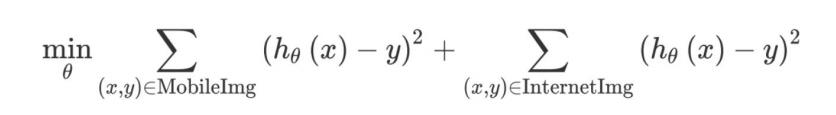
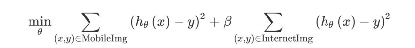

## 39 Weighting data

인터넷에서 다운로드한 200,000장의 이미지와, 앱 사용자들이 업로드한 5,000장의 이미지를 가지고 있다고 가정해 보자. 이 데이터셋들의 크기의 비율은 40:1 이다. 이론적으로, 거대한 뉴럴넷을 만들고, 모든 205,000장의 이미지에 대해서 학습을 수행하면 인터넷 이미지와 사용자가 업로드한 이미지 모든 케이스에 대하여 잘 동작하는 알고리즘을 만들어내는데 큰 위험은 없을 것이다.

그러나 실질적으로는, 40배나 더 많은 인터넷 이미지를 가지는 것은 두 종류의 데이터셋 모두를 모델링 하는데, 5,000장의 이미지에 대해서만 학습을 수행하는 것에 비하여 40배 이상의 시간이 소요됨을 의미한다. 

계산을 수행하기 위한 막강한 자원이 없다면, 절충의 방법으로 인터넷 이미지에 대해서는 더 낮은 가중치를 줄 수 있을 것이다.

예를 들어서, 최적화의 목표가 Squared Error (분류 작업에 적절한 선택은 아니지만, 설명의 간소화를 위해 선택하였음) 라면, 개발중인 학습 알고리즘은 다음을 최적화 하려고 시도하게 된다:

  

위 공식에서의 첫번째는 5,000장의 사용자가 업로드한 이미지에 대한 합이다. 그리고 두번째 공식은 200,000장의 인터넷 이미지에 대한 합을 수행한다. 또한, 추가적인 𝛽 라는 변수를 이용해서 최적화를 할 수도 있다:

  

𝛽 값을 1/40 으로 설정 했다면, 알고리즘이 5,000장의 이미지 종류와 200,000장의 이미지 종류 모두에게 동일한 가중치를 매길 것이다. 물론, 개발 데이터셋을 튜닝하기 위한 목적등을 위해 𝛽 를 다른 값으로 설정 할 수도 있다.

인터넷 이미지에 가중치를 덜 주면, 알고리즘이 두가지 종류의 데이터셋에 모두 잘 동작하도록 하기 위해 거대한 뉴럴넷을 구축할 필요가 없어진다. 이러한 가중치의 재설정은 추가적인 데이터(여기서는 인터넷 이미지)가 개발/테스트 데이터셋과는 매우 다른 분포로 구성된것 같다는 생각이 들때 필요하다. 또는 추가적인 데이터가 개발/테스트 데이터셋과 동일한 분포로 구성되었지만, 기존의 데이터보다 양이 많은 경우에도 가중치 재설정 작업이 필요하다.