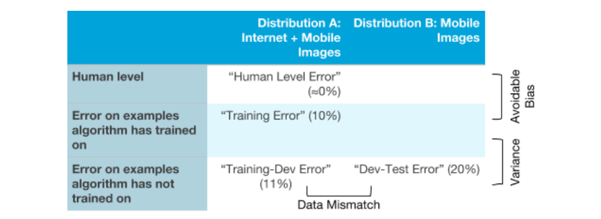

## 41 Identifying Bias, Variance, and Data Mismatch Errors

사람이 고양이를 인지하는 작업에서 거의 완벽에 가까운 (≈0%의 에러율)을 보여주고, 따라서 최적의 에러율이 0%로 설정 되었다. 이때, 다음과 같은 수치가 있따고 가정해 보자:

- 학습 데이터셋에 대한 1%의 에러율
- 학습개발 데이터셋에 대한 5%의 에러율
- 개발 데이터셋에 대한 5%의 에러율

이 사실들이 무엇을 이야기해 주는가? 높은 분산이 존재함을 알 수 있따. 분산치를 줄이는 기법은 앞서 소개되었고, 이를 통해 의미 있는 진도를 이끌어 낼 수 있다.

그러면, 알고리즘이 다음과 같은 결과를 성취 했다고 가정해 보자:

- 학습 데이터셋에 대한 10%의 에러율
- 학습개발 데이터셋에 대한 11%의 에러율
- 개발 데이터셋에 대한 12%의 에러율

위 사실들은 높은 (피할 수 있는) 편향이 학습데이터셋에 대하여 존재함을 말해준다. 예를 들어서, 알고리즘이 학습데이터에 대해서 잘 동작하지 못한다는 것이다. 편향치를 줄이는 기법들이 도움이 될 것이다.

위의 두 가지 예제에서, 알고리즘이 높은 (피할 수 있는) 편향과, 높은 분산으로 부터 고통받고 있음을 알 수 있다. 알고리즘이 높은 (피할 수 있는) 편향, 높은 분산, 그리고 데이터의 미스매치의 어떠한 것을 통해서든 고통받는 것은 충분히 가능한 일이다. 예를 들면:

- 학습 데이터셋에 대한 10%의 에러율
- 학습개발 데이터셋에 대한 11%의 에러율
- 개발 데이터셋에 대한 20%의 에러율

이 알고리즘은 높은 (피할 수 있는) 편향과 데이터 미스매치로 부터 고통받고 있다. 하지만, 학습 데이터셋 분포에서 높은 분산에 의한 고통을 받고 있지는 않다.

서로다른 에러 종류들이 어떻게 서로 연결되어 있는지 이해를 쉽게 하기 위해서, 관계를 테이블로 표현해 보겠다:

  

고양이 이미지 감지에 관한 예제에서, x-축에 서로다른 두 개의 다른 데이터 분포가 있음을 볼 수 있다. y-축에는, 세가지 종류의 에러가 있다: 사람 수준의 에러율, 알고리즘이 학습된 데이터에 대한 에러율, 그리고 알고리즘이 아직 학습하지 못한 데이터에대한 에러율. 앞선 챕터에서 확인한 서로다른 종류의 에러를 각각의 네모박스에 채워 넣을 수 있다.

위 테이블의 비어 있는 두개의 네모박스 또한 채워 넣을 수 있을 것이다: 오른쪽 위의 네모박스 (모바일에서 업로드된 이미지에 대한 사람 수준의 성능)는 모바일에서 업로드된 고양이 이미지를 실제 사람에게 레이블링을 요청하여, 그들의 에러율로 채워질 수 있다. 그 다음의 네모박스는 모바일에서 업로드된 분포B를 따르는 고양이 이미지에 대한, 뉴럴넷이 학습을 수행하는 학습 데이터셋의 소량을 통하여 채워질 수 있을 것이다. 이 두개의 추가적인 부분을 채워 넣으면, 알고리즘이 두 가지 다른 분포 (A와 B)에 대해서 어떻게 동작하는지에 대한 통찰력을 얻을 수 있을 수 있다.

알고리즘이 가장 고통밥는 에러 종류가 무엇인지를 이해하면, 편향을 줄일 것인지, 분산을 줄일 것인지, 데이터의 미스매치를 줄여 나갈것인지에 대한 결정을 내리는데 좀 더 손쉬워 질 수 있다.