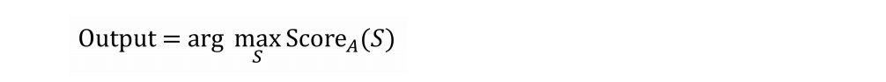

## 44 The Optimization Verification test

음성인식 시스템을 개발중이라고 가정해보자. 이 시스템은 오디오클립 A를 입력 받고, 각각의 출력 가능한 문장 S들에 대하여 Score_A(S) 값을 계산한다. 예를 들면, Score_A(S) = P(S|A) 라고 추정할 수 있는데, 이 확률은 입력 오디오가 A로 주어졌을때 올바른 출력문장 S를 뽑아낼 확률이다. Score_A(S)를 계산할 방법이 주어진 상태에서, 여전히 다음을 최대화 하는 영어문장 S를 찾아야만 한다.

  

위 공식에서 "arg max" 부분을 어떻게 계산하는가? 만약에 영어가 50,000개의 단어로 이루어져 있다면, 길이가 N인 문장들을 만들 수 있는 조합의 개수는 (50,000)^N개가 존재한다. 이는 너무나 많은 수이다. 그러면, 이 검색 알고리즘에 대하여 근사치를 적용할 필요가 있다. 이 근사치라는 것은 Score_A(S) 값을 최대화 하는 (최적화 하는) S값을 찾는 과정을 의미한다. 한가지 검색 알고리즘으로는 "beam search"라는 것이 있다. "beam search"는 검색 과정동안에 최고값을 가지는 K개의 후보만을 유지한다. (이번 챕터의 목적상, beam search 알고리즘의 상세한 부분까지 이해할 필요는 없다) 이러한 알고리즘들은 Score_A(S)값을 최대화 하는 값 S를 발견하는 것을 보장하지는 못한다.

오디오 클립 A가 누군가의 말하는 "I love machine learning"이라는 문장을 녹음한 것이라고 가정해 보자. 하지만, 이 문장을 올바르게 글로 옮겨서 출력하는것 대신에, 개발중인 시스템은 "I love robots"과 같은 올바르지 않은 결과를 출력하였다. 이때, 무엇이 잘못 되었는지에 대하여 두가지 가능성이 존재한다:

1. 검색 알고리즘 자체의 문제인 경우. 근사치를 구하는 검색 알고리즘이 Score_A(S)를 최대화 하는 값 S의 검색에 실패하는 경우이다.

2. 목표 함수 (스코어 함수)의 문제인 경우. Score_A(S) = P(S|A)에 대한 추정 결과가 부정확 했다. 특히, Score_A(S)에 대한 선택이 "I love machine learning"이 올바른 문장이라고 인식하는 것을 실패하는 경우이다.

이 두가지 실패의 원인에 따라서, 이를 해결하기 위한 노력을 어디에 써야하는지에 대한 우선순위를 정하는 방법은 매우 달라진다. 첫번째가 문제라면, 검색 알고리즘을 향상시키려고 노력해야 한다. 두번째가 문제라면, Score_A(S)를 추정하는 학습알고리즘을 향상시키는데 노력을 기울여야 한다.

이 경우를 마주하면서, 몇몇 연구자들이 무작위로 검색 알고리즘을 향상시키는 것에 대해서 노력을 하고, 또 몇몇은 무작위로 Score_A(S)를 위한 값을 학습하기 위한 더 나은 방법을 찾는데 노력을 하곤한다. 하지만, 이 두가지 중 무엇이 근본적으로 에러를 유발하는지를 알지 못한다면, 어떤 노력이든지 시간 낭비가 된다. 어떻게 하면, 어디에 노력을 기울일지에 대한 결정을 좀더 시스템적으로 내릴 수 있을까?

S_out을 ("I love robots")이라는 출력 결과라고 하자. 그리고, S*는 ("I love machine learning")이라는 올바른 결과값이라고 정하자. 위의 첫번째 또는 두번째 중, 어느것이 문제인지를 이해하기 위해서, 최적화 검증 테스트(Optimization Verification test)를 수행해 볼 수 있다: 첫번째로, Score_A(S*)와 Score_A(S_out) 값을 계산한다. 그리고, Score_A(S*) > Score_A(S_out) 조건을 만족하는지를 확인해 본다. 그러면 두가지의 가능성이 있는데:

(첫번째 가능성) 케이스 1: Score_A(S*) > Score_A(S_out)

케이스 1에 대해서, 학습 알고리즘은 S_out보다 더 높은 스코어값을 얻어냄으로 올바른 S*결과를 뽑아 내었다고 볼 수 있다. 그럼에도 불구하고, 사용된 근사치를 구하는 검색 알고리즘은 S*대신에 S_out을 선택하였다. 이 상황은 검색 알고리즘이 Score_A(S)를 최대화 하는 값 S를 선택하는데에 실패했다는 것을 말해준다. 이때, 최적화 검증 테스트는 사용된 검색 알고리즘 자체에 문제가 있고, 이것을 개선하는데 초점을 맞춰야 한다는 것을 말해준다. 예를 들어서, beam search의 beam width를 증가시키는 것과 같은 시도 말이다.

(두번째 가능성) 케이스 2: Score_A(S*) <= Score_A(S_out)

케이스 2에 대해서, Score_A() 를 계한하는 방식이 잘못되었다는 것을 알고 있다. 올바른 출력인 S*에 S_out보다 더 높은 스코어값을 엄격히 부여해야 하는 것에 실패 하였다와 같이 말이다. 최적화 검증 테스트는 목적 함수(스코어 함수)에 문제가 있다는 것을 말해준다. 그렇기 때문에, 어떻게 다른 문장들 S에 대하여 Score_A(S)의 근사치를 구하는 방법을 향상시키는 것에 초점을 맞춰야 한다.

우리는 한가지 예에 대해서 초점을 맞춰 왔다. 실전에서 최적화 검증 테스트를 적용하기 위해서, 개발 데이터셋에 대한 에러를 들여다 봐야만 한다. 각각의 에러에 대하여, Score_A(S*) > Score_A(S_out) 인지 아닌지를 테스트 해봐야 할 수 있다. 이 불균형에 대한 각각의 개발 데이터셋의 예제데이터는 최적화 알고리즘으로 부터 발생하는 에러라고 마킹될 것이다. Score_A(S*) <= Score_A(S_out) 조건을 만족하지 않는 각각의 예제 데이터는 Score_A()를 계산하는 방식때문에 발생한 실수라고 볼 수 있게 된다.

한가지 예를 들어보자. 총 에러 중, 스코어 함수 Score_A() 때문에 95%의 에러가 발생했음을 발견 하였고, 최적화 알고리즘때문에 발생한 에러는 단지 5% 뿐임을 알게 되었다. 그러면, 얼마나 최적화 과정을 향상시키든지 간에, 현실적으로 발생한 에러에서 최대 ~5%까지만을 제거하는 것이 가능하다. 이렇게 되면, 대신에 Score_A() 함수를 향상시키는 방법에 초점을 맞춰야만 한다.
