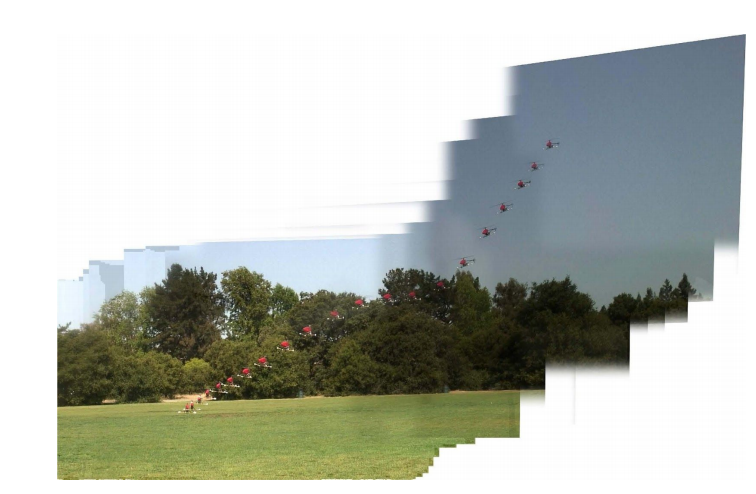

## 46 Reinforcement learning example

  

머신러닝을 사용해서, 헬리콥터에게 복잡한 동작을 통한 비행 방법을 가르치려고 한다. 위에는 컴퓨터가 꺼진 엔진 상태로 착륙하는 헬리콥터를 컨트롤하는 타임랩스 사진이다.

이것은 보통 "자동회전" 동작이라고 불린다. 헬리콥터가 엔진이 망가졌을때 조차도 착륙이 가능하게 해준다. 사람 조종사는 이 동작을, 트레이닝의 한 절차로서 연습을 한다. 우리의 목표는 학습 알고리즘을 사용해서 안전한 착륙으로 이어지는 T 궤적을 통해서 헬리콥터가 날 수 있도록 하는 것이다.

강화학습을 적용하기 위해서, "보상함수 (Reward function)", R()을 개발해야만 한다. 이 보상 함수는 각각의 가능한 궤적 T가 얼마나 좋은지에 대한 스코어를 측정하게 된다. 예를 들어서, 만약 T라는 궤적이 헬리콥터의 사고로 이어진다면, 아마도 보상값은 R(T) = -1,000 정도로 아주 큰 음수값일 것이다. 반면에, 안전한 착륙으로 이어지는 궤적 T는 양수값을 가지는 R(T)일 것이고, 정확한 값은 얼마나 그 착률이 매끈하게 이루어 졌냐에 따라 달라진다. 보상함수 R()은 보통 다른 궤적들이 얼마나 가치있는지를 수치화하기 위한 것으로, 사람의 손으로 선택되어진다. 착률이 얼마나 매끄럽지 못한지, 헬립콥터가 목표한 지점에 정확히 착륙했는지, 착률이 얼마나 승객들에게 거칠었는지, 등등과 같은 것들 사이에 트레이드 오프가 존재한다. 따라서 좋은 보상함수를 디자인 하는것은 꽤나 어려운 일이다.

주어진 보상함수 R(T)에 대하여, 강화학습 알고리즘이 하는 일은 헬리콥터를 조종하여 max_T R(T)를 얻을 수 있도록 하는 것이다. 하지만, 강화학습 알고리즘은 많은 근사치들을 만드는데, 그렇기 때문에 이 최대치값을 얻는데 성공을 못 할 지도 모른다.

어떤 보상함수 R()을 선택했고, 학습 알고리즘을 수행했다고 가정해보자. 하지만, 그 성능은 착률이 매끄럽지 못한점, 안전하지 못한점등에서 사람 조종사보다 훨씬 좋지 않았다. 어떻게하면 이 실패가 max_T R(T)의 결과를 가져오는 궤적을 구하기 위한 강화학습 알고리즘에 의한 것이라고, 또는 이 실패가 매끄러움과 착률지점의 정확도 사이의 이상적인 트레이드-오프를 측정하기 위한 보상함수에 의한 것이라고 말할 수 있을까?

최적화 검증 테스트를 적용하기 위해서, T_human을 사람 파일럿이 이동한 궤적이라 하고, T_out을 알고리즘에 의해 이동된 궤적이라고 해보자. 위의 설명에 따르면, T_human은 T_out보다 우수한 궤적이다. 따라서, 주된 테스트는 다음이 되어야 한다. R(T_human) > R(T_out)이라는 테스트가 true로 지속되는가?

케이스 1: 만약 위의 부등식이 지속된다면, 보상함수 R()은 올바르게 T_human이 T_out 보다 우수하다고 말해주는 것이다. 하지만, 강화학습 알고리즘이 열등한 T_out을 발견하였다면, 이 사실은 강화학습 알고리즘을 향상시키는데 시간을 투자하는 것이 의미 있다는 것을 말해준다.

케이스 2: 만약 위의 부등식이 지속되지 않는다면 (R(T_human) ≤ R(T_out)), 이것은 R()이 비록 더 우수한 궤적일 지라도 T_human 에게 안좋은 점수를 매기는 것을 의미한다. 그러면, R()를 향상시키는데 시간을 투자하여 좋은 착륙에 걸맞는 트레이드-오프를 더 잘 판단하도록 해야한다.
