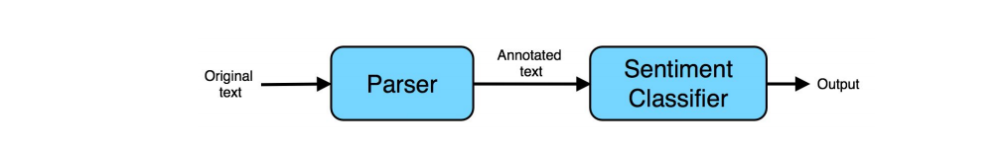
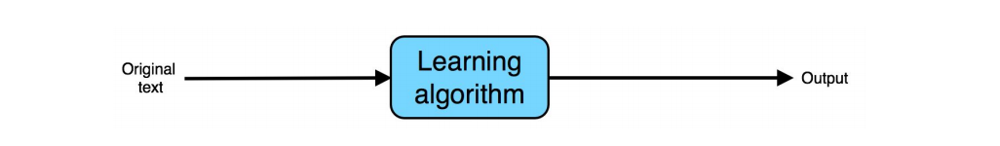

## 47 The rise of end-to-end learning

온라인 상품에 대한 리뷰를 분석하여 자동으로 그 리뷰작성자가 해당 상품을 좋아했는지 아닌지를 구분하는 시스템을 구축하고 있다고 생각해 보자. 예를 들어서, 다음과 같이 매우 긍정적인 리뷰를 인식하길 희망할 수 있다:

> This is a great mop! (이 대걸레는 아주 훌륭해요!)

또는 다음과 같이 아주 부정적인 리뷰를 인식하고자 할 수 있다:

> This mop is low quality--I regret buying it. (이 대걸레의 퀄리티가 매우 낮아요 - 산 것을 후회 합니다.)

긍정의 의견 vs. 부정의 의견을 인식하는 문제는 보통 "감정 분류(sentiment classification)" 이라고 불린다. 이러한 시스템을 만들기 위해서, 두가지 컴포넌트로 이루어진 "파이프라인"을 구성해야 할 것이다:

1. 파서 (Parser): 일종의 시스템으로, 텍스트에 어노테이션(노트)을 다는 역할을 한다. 이 어노테이션에는 가장 중요한 단어를 감별하기 위한 정보가 포함된다. 예를 들어보자. 이 파서라는 시스템을 사용하면 모든 형용사와 명사들에 대하여 레이블링 하는 것이 가능하다. 그래서 다음과 같이 어노테이션화된 텍스트를 얻게 된다.

> This is a great(형용사) mop(명사)!

2. 감정 분류자 (Sentiment classifier): 학습 알고리즘으로, 어노테이션화된 텍스트를 입력으로 받아들여서 전체적인 감정을 예측한다. 파서의 어노테이션이 학습 알고리즘에게 크게 도움을 줄 수 있다: 형용사들에게 큰 가중치를 할당하면, 알고리즘이 빠르게 "great"와 같은 중요한 단어에 대해서 연마될 수 있고, "this." 처럼 덜 중요한 단어는 무시할 수 있게 된다.

이 두개의 컴포넌트간의 "파이프라인"을 다음과 같이 시각화 해볼 수 있다:

  

최근에 이 파이프라인된 시스템을 하나의 학습 알고리즘으로 대체하는 것이 트렌드가 되고 있다. End-to-End 학습 알고리즘은 단순히 가공되지 않은 데이터인, 원본 텍스트 "This is a great mop!"를 입력으로 받고, 직접적으로 감정을 인식하려고 한다:

  

인공신경망이 보통 이러한 End-to-End 학습 시스템에서 사용된다. "End-to-End"라는 용어는 학습알고리즘이 직접적으로 입력으로 부터 원하는 출력까지 도달한다는 사실을 의미한다. 예를 들어서, 학습 알고리즘은 직접적으로 시스템의 "입력의 끝" 부분과 "출력의 끝" 부분을 연결한다고 할 수 있다.

데이터가 넘쳐나는 문제에서, End-to-End 시스템은 매우 성공적이어 왔다. 하지만, 이 시스템이 항상 좋은 선택지라는 것은 아니다. 다음 몇몇 챕터에서는 End-to-End 시스템에 대한 더 많은 예제를 다루고, 언제 사용해야 하는지, 언제 사용해선 안되는지와 같은 조언을 줄 것이다.
