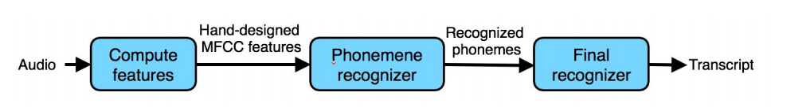
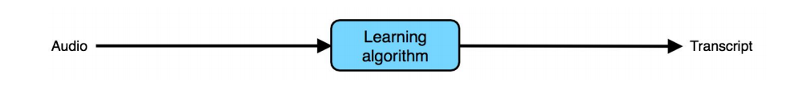
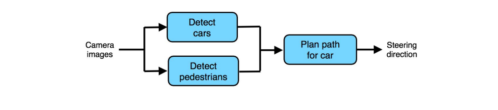

## 48 More end-to-end learning examples

음성인식 시스템을 구축한다고 가정해보자. 다음과 같이 세가지 컴포넌트로 시스템을 구성할 수 있을 것이다.

  

각 컴포넌트들은 다음과 같이 동작한다:

1. Features의 계산: 사람의 손으로 디자인된 features를 추출하는 것으로 MFCC(Mel-frequency cepstrum coefficients) features 같은 것이 있다. 이것의 역할은 스피커의 통과 같이 상대적으로 관계 없는 속성은 무시하면서도 그 사람이 하는 말의 내용물을 포착하는 것이다.

2. 음소의 인식자: 몇몇 언어학자들은 "음소"라고 불리는 소리의 가장 기본이 되는 단위가 있다고 생각한다. 예를 들어서, "keep" 이라는 단어의 "k"라는 소리는 "cake"이라는 단어의 "c"라는 소리와 동일한 음소를 가진다. 이 시스템은 오디오 클립에 포함되어 있는 음소들을 인식하는 역할을 한다.

3. 마지막 인식자: 순차적으로 인식된 음소들을 가지고, 이들을 모두 함께 고려하여 이를 글로 옮겨서 출력하는 기능을 담당한다.

이와 대조적으로, End-to-End 시스템은 오디오 클립을 입력으로 받아들이고, 직접적으로 글로 옮겨진 출력을 뽑아낸다.

  

지금까지 일직선적으로 "파이프라인"된 기계학습에 대해서 다루었다. 일직선이라는 것은 출력이 이전 단계의 결과가 다음 단계의 입력으로서 전달되는 일련의 과정을 의미한다. 파이프라인은 사실상 이보다 더 복잡해질 수 있다. 한가지의 예로, 아래와 같은 자율주행 자동차 시스템의 간단한 구성도를 들 수 있다:

  

여기에는 세가지 컴포넌트가 존재한다: 하나는 카메라 이미지로 다른 자동차의 유무를 감지한다; 그 다음으로는 보행자를 감지하는 컴포넌트가 있다; 마지막으로 운전하는 자동차가 움직여야 하는 길을 계획하는 컴포넌트가 있는데, 이는 자동차와 보행자를 피하는 역할도 포함한다.

파이프라인에 있는 모든 컴포넌트들이 학습되어야 하는 것은 아니다. 예를 들어서, "robot motion planning"이라는 교과서는 자동차가 가야하는 길을 계획하기 위한 수 많은 알고리즘을 보여준다. 이 알고리즘 중 많은 것들이 학습과는 무관한 것들이다.

이와 대조적으로, End-to-End 접근 방식은 센서데이터를 입력으로 받아서 직접적으로 움직여야 하는 방향을 출력으로 뽑아낸다:

  

End-to-End 학습이 많은 성공적인 사례를 보여주고 있지만, 항상 최고의 접근 방식이라고 할 수는 없다. 예를 들어서, End-to-End 음성인식이 잘 동작 하지만, 자율주행 시스템에 대해서는 End-to-End 학습 방법에 대해서 의구심이 들 수도 있는 것이다. 다음 몇 챕터들은 왜 그런지에 대하여 설명한다.
