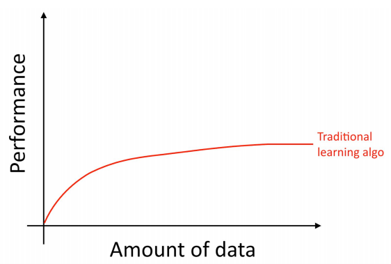
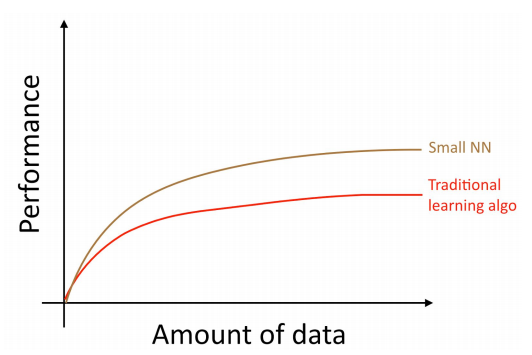
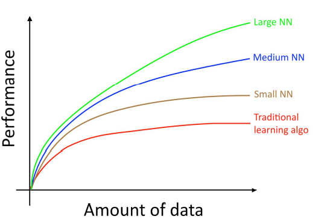

## 4 Scale drives machine learning progress
딥러닝 (인공신경망)에 대한 수 많은 아이디어가 10년 이상 존재해 왔었다. 그런데, ***왜 이제와서 급격하게 인기를 얻는 것일까?*** 최근 두 가지의 큰 진척이 이를 가능하게 했다고 볼 수 있다.

- __데이터의 입수 가능성__ 사람들이 디지털 장비에 갈수록 더 많은 시간을 소비하고 있다. 이러한 디지털 장비 사용은 많은 양의 데이터를 생성하게 되고, 이 데이터는 학습 알고리즘에 인풋 데이터로서 활용될 수 있게 된다.

- __계산 규모__ 수 년전에야 비로소 거대한 데이터로 부터 이득을 취할 수 있는 큰 사이즈의 인공신경망을 학습 시킬 수 있게 되었다.

좀 더 자세히 말해보자면, 당신이 더 많은 데이터를 축적 하더라도, ***예전의 학습 알고리즘*** (logistic regression과 같은) 에 대한 성능은 ***보통 일직선으로 수렴*** 하게 된다 (특정 시점 이후 더 이상 개선이 안되는 현상). 러닝 커브가 평평해 짐을 의미하고, 더 많은 데이터를 입력하더라도 알고리즘은 더 이상 개선되지 못하게 된다.

  

이것은 마치 예전의 알고리즘들은, 수집된 거대한 데이터를 어떻게 사용해야 하는지 모르는 것 같아 보였다. 하지만, 만약 ***작은 인공신경망*** 을 동일한 지도학습 문제에 적용한다면, 약간은 ***더 나은 결과*** 를 얻을 수 있을지도 모른다.

  

여기서 언급한 "작은 인공신경망"은 작은 수의 "히든 유닛", "레이어", "파라메터"로 구성된 인공신경망을 의미한다. 더욱이, 계속해서 ***더 큰 인공신경망*** 을 이용하여 학습을 시도하는 경우에 ***더 나은 결과*** 를 얻을 수 있게 된다.

> 위 다이어그램은 작은 양의 데이터에서, 인공신경망이 더 나은 성능을 가진다는 것을 알 수 있다. 이 현상은 거대한 데이터에 대하여, 인공신경망이 꽤 나은 결과를 보여주는 현상과는 약간 다른 양상을 보여준다. ***작은 양의 데이터*** 에 대하여, ***얼마나 features들이 수작업으로 잘 엔지니어링 되었는지*** 에 따라서, ***전통적인 알고리즘이 더 좋은 결과를 보일 수도 있고 그렇지 않을 수도 있다*** . 예를 들어서, 20개의 학습 데이터가 있는 경우, logistic regression을 사용하는 것과 인공신경망을 사용하는 것 사이에 큰 차이가 없을 수 있다. 이때는 학습 데이터의 feature에 대한 엔지니어링된 정도가 알고리즘을 선택하는것 보다 큰 효과가 있을 수 있다. ***하지만*** , 만약에 ***100만개의 학습 데이터*** 가 있는 경우에는 거의 ***항상 인공신경망*** 을 사용하는게 좋다고 볼 수 있다.

  

이렇게, (i) 매우 큰 인공신경망에 학습을 시도할 때에 최고의 성능을 얻을 수 있다. 위 그림의 (ii) 녹색 곡선 처럼 큰 인공신경망에는 거대한 양의 데이터가 필요하다. 물론, 인공신경망의 구조를 설계하는 다른 많은 부분이 중요하고, 이에 대한 많은 발전이 이루어 지고 있다. 하지만, 알고리즘의 ***성능을 향상*** 시키기 위한 ***가장 안정적인 방법*** 중 하나는 여전히 ***(i) 더 큰 네트워크*** 의 사용과 ***(ii) 더 많은 데이터*** 를 모으는 것이다.

(i) 과 (ii)를 성취하기 위한 과정은 놀랍게도 매우 복잡하다. 이 책은 그 방법에 대해서 자세하게 다룰 예정이다. 우선 전통적인 알고리즘과 인공신경망 모두에게 유용한 일반적인 전략에 대해 설명하고, 그리고나서 딥러닝 시스템을 구축하기 위한 가장 현대적인 방법에 대하여 다루게 될 것이다.
