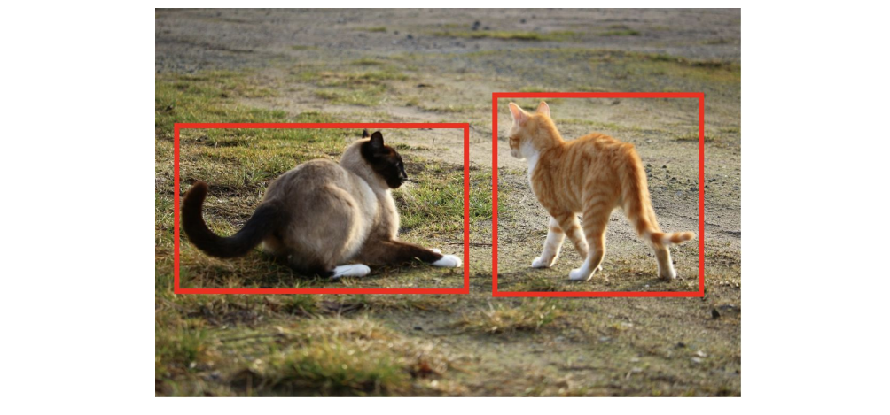
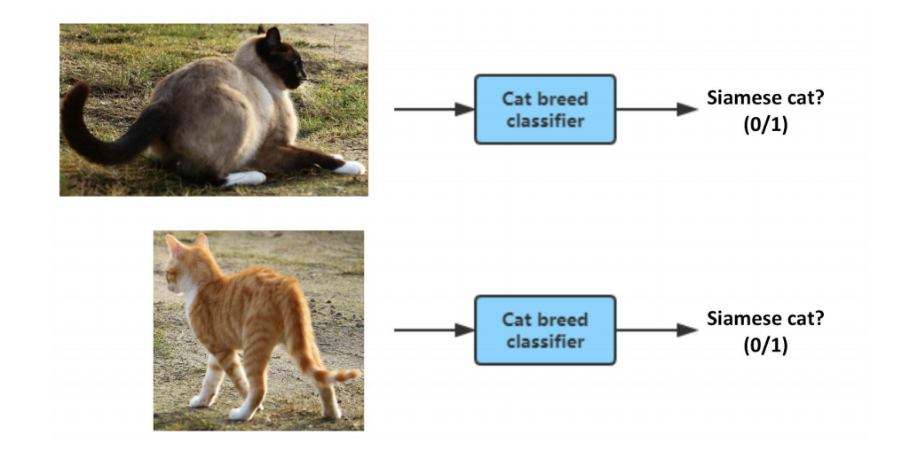

## 51 Choosing pipeline components Task simplicity

데이터의 가용성 이외에, 파이프라인의 컴포넌트를 선택할때 두번째 요소 또한 고민해 봐야한다: 각각의 컴포넌트가 얼마나 주어진 작업을 간단하게 해결하는가? 각가의 컴포넌트가 쉽게 개발가능하고, 학습될 수 있는 것으로 구성되도록 노력해야한다. 그런데, 컴포넌트가 "쉽게" 배울 수 있다는 것의 의미는 무엇일까?

  

다음의 기계학습 작업을 고려해보자. 점점 더 어려운 순서로 나열되어 있다.

1. 이미지가 과다 노출되었는지를 분류하는 것 (위 사진의 예제 처럼)
2. 이미지가 실내나 실외에서 찍혔는지를 분류하는 것
3. 이미지가 고양이를 포함하는지를 분류하는 것
4. 이미지가 검은색과 흰색 털을 가진 고양이를 포함하는지를 분류하는 것
5. 이미지가 샴 고양이를 포함하는지를 분류하는 것 (고양이의 특정 종)

이것들의 각각은 바이너리 이미지 분류 작업들이다: 이미지를 입력으로 줘야만 하고, 출력은 0이냐 1이냐가 된다. 하지만, 리스트의 앞선 항목일수록 인공신경망이 학습하기에 더 쉬운 문제처럼 보인다. 더 쉬운 작업은 더 작은 학습 데이터셋으로 학습될 수 있다.

기계학습은 아직 어떤 작업을 쉽거나 어렵게 만드는것이 무엇인지에 대한 공식적으로 좋은 정의는 아니다. 딥러닝의 등장, 그리고 다층 레이어의 인공신경망의 등장과 함께, 얕은 인공신경망과 같이 좀 더 작은 계산 과정을 통해서 결과가 도출된다면, 때때로 이 작업은 "쉽다"라고 말하곤 한다. 그리고, 더 깊은 인공신경망과 같이 더 많은 계산 과정이 요구된다면, "어렵다"라고 말하곤 한다. 하지만, 이 모두가 비공식적인 정의방법일 뿐이다.

복잡한 작업을 수행할 수 있고, 이를 작은 단위의 간단한 작업들로 쪼갤 수 있다면, 각각의 작은 작업들을 구분적으로 코딩해서 알고리즘에게 더 효율적인 학습에 도움이되는 선행지식을 전해줄 수 있다.

  

샴 고양이 감지 시스템을 개발한다고 가정해보자. 이때 사용되는 방법은 End-to-End 이다:

  

대조적으로, 두 단계로 구성되는 파이프라인 방법을 사용할 수도 있다:

  

첫번째 단계 (고양이 감지)는 이미지에 있는 모든 고양이들을 감지한다.

  

두번째 단계는 각각의 감지된 고양이 부분만 잘라내진 이미지를, 고양이 종 분류 단계로 전달한다. 그러면, 그 고양이가 샴 고양이로서 감지되는 경우, 1이라는 값을 출력하게 된다.

  

레이블로 단순히 0과 1을 사용하는 순수한 End-to-End 분류방법을 학습 시키는 것과 비교해 보면, 파이프라인에 있는 각 두개의 컴포넌트는 학습되기가 훨씬 더 쉽고, 훨씬 더 적은 데이터를 요구하게 된다.

마지막 예제로서, 자율주행 자동차에 대한 파이프라인을 다시 한번 살펴보자.

  

이 파이프라인을 사용해서, 알고리즘에게 3가지 중요한 단계를 통해서 운전해야 한다는 것을 알려준다: (1) 다른 자동차를 감지하고, (2) 보행자를 감지하고, (3) 자동차가 가야할 길을 계획해야 한다. 더욱이, 각각의 단계들은 End-to-End 방식과 비교해보면 비교적 간단한 기능들이고, 적은 데이터로도 학습될 수 있다.

요약해보면, 파이프라인의 컴포넌트들로는 무엇이 되어야하는지를 결정할 때, 비교적 "간단한" 기능으로 적당한(또는 적은) 양의 데이터로 학습될 수 있는 컴포넌트들로 파이프라인을 구성해보자.
