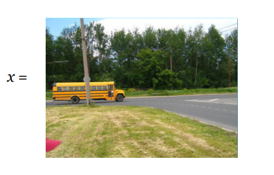
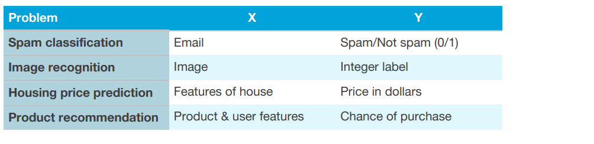

## 52 Directly learning rich outputs

이미지 분류 알고리즘은 이미지 x를 입력 받고, 개체의 카테고리를 나타내는 정수를 출력으로 내놓는다. 이러한 출력 대신에, 알고리즘이 이미지를 묘사하는 전체적인 문장을 출력할 수도 있을까?

예를 들어서:

  

위의 그림에 대한 출력 y는:

y = "초록색 나무와 잔디를 배경으로한 길에서 노란색 버스가 운전해 오고 있다"가 될 수 있다.

전통적인 지도학습 어플리케이션은 함수 h:X→​Y 를 학습했는데, 이때 출력 y는 보통 정수 또는 실수의 값을 가진다. 예를 들어보자:

  

End-to-End 딥러닝에서 한가지 가장 흥미로운점은 숫자보다 훨씬 더 복잡한 형태의 y를 직접적으로 학습하는 것을 가능하게 한다는 것이다. 위의 이미지-자막 예제에서, 인공신경망에 입력 이미지 (x)를 받아서 바로 직접적으로 출력인 자막 (y)를 얻을 수 있다.

몇가지 더 많은 예제를 나열해 보겠다:

  

이것은 딥러닝 분야에서 점점더 속도가 붙고 있는 트렌드 중 하나이다: 올바르게 레이블링된 (입력, 출력) 페어의 데이터가 있을때, 때로는 출력이 문장, 이미지, 오디오, 또는 숫자보다 훨씬 더 고차원적인 다른 형태의 출력에 대하여 End-to-End를 학습 시킬 수 있다.
