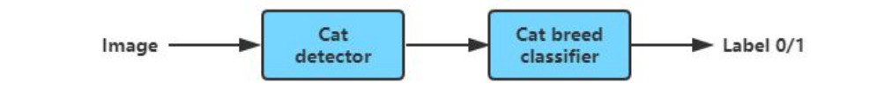
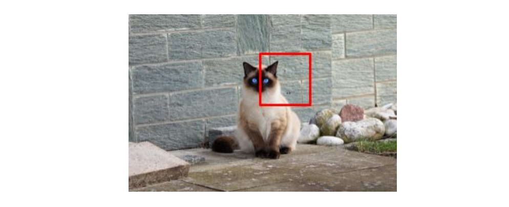
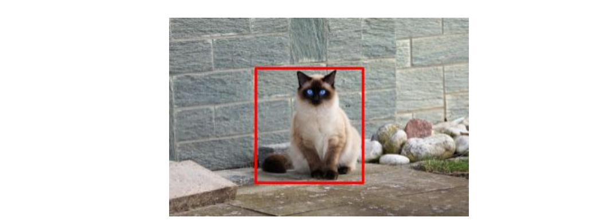

## 54 Attributing error to one part

앞서 사용한 예를 계속 사용해서 설명한다:

  

고양이 감지 컴포넌트가 다음과 같은 사각형을 출력했다고 가정해보자:

  

순차적으로, 고양이 종 감지를 담당하는 컴포넌트는 이 부분에 대해 잘려진 이미지를 입력 받는다. 그리고 그 때문에 올바르지 못한 결과인 y=0을 출력하거나 사진에는 고양이가 없다는 결과를 출력하게 된다.

  

고양이 감지 컴포넌트가 맡은 업무를 잘 수행하지 못했다. 하지만, 아주 숙련된 사람은, 분명히 해당 사각형 속의 이미지에서 샴고양이를 감지할 수 있을 것이다. 그렇다면, 이 에러를 고양이 감지 컴포넌트의, 또는 고양이 종 분류 컴포넌트의, 또는 두 컴포넌트 모두의 잘못이라고 판단해야 할까? 꽤나 모호한 상황이다.

이와 같이 모호한 경우의 수가 적다면, 그냥 원하는대로 결정을 내리고 비슷한 결과를 얻을 수 있을 것ㅇ디ㅏ. 하지만, 좀더 공식적인 테스트 방법이 있다. 이 공식적인 테스트 방법은 좀더 확실하게 에러가 어느 컴포넌트의 잘못인지를 결정할 수 있게 해준다:

1. 고양이 감지 컴포넌트의 출력결과를 사람의 손으로 레이블링된 사각형으로 교체해 보자

  

2. 교체된 사각형 속의 이미지를 고양이 종 분류 컴포넌트에게 입력으로 던져주자. 만약 고양이 종 분류 컴포넌트가 여전히 잘못된 분류 결과를 보여준다면, 이 에러는 고양이 종 분류 컴포넌트의 잘못이다. 그렇지 않다면, 고양이 감지 컴포넌트의 잘못일 것이다.

다시 말해보면, 고양이 종 분류 컴포넌트가 "완벽한" 입력을 받았을때에 대한 실험을 수행해 본다는 것이다.

여기에는 다음과 같은 두가지 경우가 존재한다:

- 케이스 1: "완벽한" 사각형 속 이미지가 주어졌을 지라도, 고양이 종 분류 컴포넌트가 여전히 잘못된 결과인 y=0을 출력하는 경우. 이 경우에는, 확실히 고양이 종 분류 컴포넌트의 잘못이라고 볼 수 있다.
- 케이스 2: "완벽한" 사각형 속 이미지가 주어졌을 때, 고양이 종 분류 컴포넌트가 이번에는 올바른 결과인 y=1을 출력하는 경우. 이 경우는 고양이 분류 컴포넌트가 좀더 완벽한 사각형을 입력으로 전달 했더라면, 전체 시스템의 출력이 올바르게 되었을 것이다라는 것을 보여준다. 따라서, 해당 에러는 고양이 분류 컴포넌트의 잘못이라고 볼 수 있다.

개발 데이터셋의 잘못 분류된 이미지에 대하여, 위와 같은 분석을 수행함으로써 이제는 분명하게 각 에러가 어느 컴포넌트의 책임인지를 결정지을 수 있다. 이것은 에러들의 부분 조각들이 파이프라인의 각 컴포넌트에 의한 것이라고 추정할 수 있게 해주고, 어디에 좀더 초점을 맞춰서 성능 향상을 노려야 하는지에 대한 결정을 도와준다.
