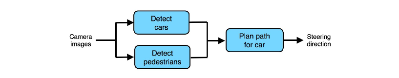

## 55 General case of error attribution

발생한 에러가 속하는 컴포넌트를 확인하기 위한 일반적인 단계를 알아보자. 파이프라인이 세가지 컴포넌트인, A, B, 그리고 C로 구성되어 있다고 가정 해 본다. 컴포넌트 A는 직접적으로 B로 연결되고, B도 마찬가지로 C로 연결 된다.

  

개발 데이터셋에 대해서 시스템이 실수한 각 부분에 대하여:

1. 수동적으로 A의 출력을 "완벽한" 출력으로 수정하고, 이 출력값을 이용해서 파이프라인의 나머지 부분인 B와 C를 수행해 보는 것을 시도 해 보자. 만약 이 시도가 올바른 결과를 가져온다면, A의 출력이 좀 더 좋은 것 이었다면 전체 알고리즘의 출력도 더 올바른 것이었을 것이라는 것을 보여준다; 이렇게, 이 에러의 실수를 컴포넌트 A의 잘못이라고 판단할 수 있을 것이다. 그러나, 결과가 올바르지 않았다면 다음 단계로 넘어가야 한다.

2. 수동적으로 B의 출력을 "완벽한" 출력으로 수정하는 것을 시도 해 보자. 만약 이때, 알고리즘이 올바른 결과를 가져온다면, 이 에러의 책임은 컴포넌트 B에 있는 것이다. 그러나, 결과가 올바르지 않았다면 다음 단계로 넘어가야 한다.

3. 이 에러는 컴포넌트 C의 잘못인게 된다.

이번에는 좀 더 복잡한 예를 살펴보자:

  

개발 중인 자율주행 자동차가 위의 파이프라인을 사용하고 있다. 어떤 컴포넌트에 좀 더 집중할지를 결정하기 위해서, 각 파트별로 어떻게 에러 분석을 수행해야 할까?

세 개의 컴포넌트를 다음과 같이 A, B, C로 매핑할 수 있다:

A: 자동차 감지
B: 보행자 감지
C: 내 자동차의 이동경로 계획

위에서 설명된 절차에 따르면, 우선 이 자동차가 폐쇄된 길에서 테스트 되는데, 숙련된 운전자에 비해서 좀 더 삐걱거리는 핸들링이 수행되는 경우를 찾고 있다고 가정 해 보자. 자율주행의 세상에서는 이러한 경우는 흔히 하나의 **시나리오** 라고들 한다. 그러면 다음의 에러 분석을 수행할 수 있을 것이다:

1. 수동적으로 A의 출력을 "완벽한" 출력으로 수정하는 것을 시도 해 보자 (예를 들어서, 어디론가 수동적으로 차를 움직인 후, 다른 차들이 어디에 있는지를 입력한다). 파이프라인의 나머지 부분인 B와 C를 그대로 수행한다. 다만, C가 A의 완벽한 출력값을 사용할 수 있도록 한다. 만약 이때 알고리즘이 더 좋은 길을 찾을 수 있다면, A의 더 좋은 결과가 전체 알고리즘의 더 좋은 출력으로 이어지게 만든다는 것을 보여준다; 이렇게, 이 에러는 A의 잘못이라고 판단할 수 있을 것이다. 그러나, 결과 적으로 경로가 더 좋지 않은 것이라면, 다음 단계로 넘어가야 한다.

2. 수동적으로 B의 출력을 "완벽한" 출력으로 수정하는 것을 시도 해 보자. 만약 이때, 알고리즘이 올바른 결과를 가져온다면, 이 에러의 책임은 컴포넌트 B에 있는 것이다. 그러나, 결과가 올바르지 않았다면 다음 단계로 넘어가야 한다.

3. 이 에러는 컴포넌트 C의 잘못인게 된다.

머신러닝(ML) 파이프라인을 구성하는 컴포넌트들은 방향성 비순환성 그래프(Directed Acyclic Graph, DAG)를 따르는 순서로 정렬 되어야만 한다. 이것은 고정된 왼쪽에서 오른쪽의 순서로 컴포넌트들에 대한 계산을 수행해야만 하고, 나중에 컴포넌트들은 순서상 왼쪽에 있는 컴포넌트의 결과에 의존적이게 되야 함을 의미한다. 컴포넌트의 매핑 관계가 A->B->C 순서로 DAG 순서체계를 따른다면, 에러 분석은 문제 없이 잘 수행 될 것이다. 만약에 A와 B의 순서를 뒤바꾸면, 약간 다른 결과를 얻을 지도 모른다:

A: 보행자 감지
B: 자동차 감지
C: 내 자동차의 이동경로 계획

하지만, 이 분석의 결과는 여전히 유효하고, 집중해야 하는 부분을 결정하는데 좋은 가이드 역할을 할 것이다.
