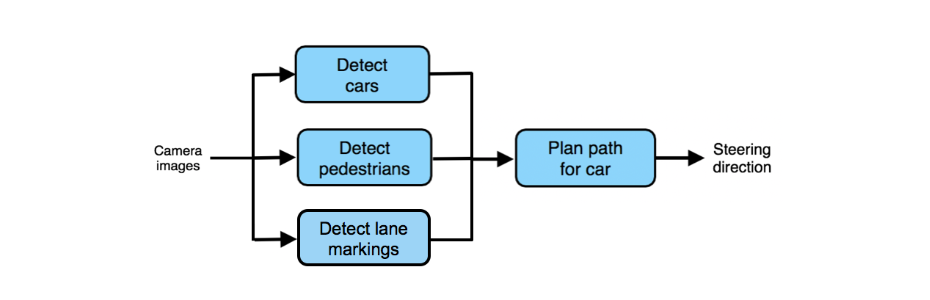

## 57 Spotting a flawed ML pipeline

ML 파이프라인에 있는 각각의 컴포넌트가 사람-수준 또는 사람-수준에 준하는 성능을 보인지만, 전체 파이프라인은 사람-수준에 한참 미치지 못한다면 어떠한가? 이것은 보통 파이프라인에 결함이 있고, 파이프라인이 다시 설계 되어야함을 의미한다. 에러 분석 또한 파이프라인의 재설계가 필요한지에 대한 이해를 도와준다.

  

직전의 챕터에서, 위의 세개 컴포넌트의 성능이 각각 사람 수준인지 아닌지에 대한 질문을 제기하였다. 이 세가지 질문에 대한 대답이 "예"라고 가정해 보자. 그러면:

1. 자동차 감지 컴포넌트는 카메라 이미지로 부터 자동차를 감지하는데 있어서 어느정도 사람-수준의 성능을 보여준다.

2. 보행자 감지 컴포넌트는 카메라 이미지로 부터 보행자를 감지하는데 있어서 어느정도 사람-수준의 성능을 보여준다.

3. 파이프라인 앞단에 위치한 두 컴포넌트의 출력을 사용해서 경로를 계산해야 하는 사람과 비교해서, 경로 계산 컴포넌트의 성능은 비슷한 수준에 있다.

하지만, 전체적인 자율주행 자동차는 사람-수준의 성능보다 매우 나쁜 성능을 보여준다. 예를 들어서, 사람이 카메라 이미지에 대한 접근이 가능할 때, 경로 계산을 훨씬 더 잘한다. 이때는 어떤 결론을 내릴 수 있는가?

단 한가지 가능한 결론은 ML 파이프라인에 문제가 있다는 것이다. 이 경우에, 경로 계산 컴포넌트는 주어진 입력에 대해서 잘 동작하지만, 이 입력이라는 것은 충분한 정보를 포함하지 못할 수 있다. 그러면, 어떤 다른 정보가 자동차에게 더 나은길을 계산 해 주기 위해서 필요한지 질문을 제기해 봐야만 한다. 다시 말해보면, 어떤 다른 정보들이 숙련된 사람 운전자들에게 필요한가? 이다.

  

궁극적으로, 모든 각각의 컴포넌트가 사람-수준의 성능을 보여주지만, 전체 파이프라인이 사람-수준의 성능에 도달하지 못한다고 생각된다면, 파이프라인 자체에 문제가 있는 것이고, 재설계가 되어야만 한다.
