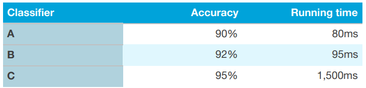

## 9. Optimizing and satisficing metrics

***여러개의 평가지표를 결합하는 또 다른 방법*** 을 소개해 보겠다.

학습 알고리즘의 수행 시간과 정확도, 두 개를 모두 고려해야 하는 상황을 가정해 보자. 그리고, 다음과 같은 3가지 분류 알고리즘에 대하여 그 결과를 조사하였다고 가정해 보자.

  

이 경우, 아래와 같은 공식으로 정확도와 수행시간을 결합하여 단일숫자 평가지표를 계산하는것은 꽤나 부자연스럽게 느껴진다.
- 정확도 - 0.5 * 수행시간

대신에 이렇게 해볼 수 있다
- 우선, 최소한의 납득 가능한 수행시간을 정의 하자. 예를 들어서, 100ms가 최소한으로 납득 가능하다고 설정해 볼 수 있다. 그리고 나서는, 이 수행시간에 기반하여 정확도를 최대화 해볼 수 있다. 여기서 수행시간은 ***"만족화 지표(satisficing metric)"*** 로 수행하는 알고리즘은 이 지표에 대해서 만족만 하면 된다(지나치게 좋을 필요도 없고 딱 그정도). 그러고 나면, 정확도는 ***"최적화 지표(optimizing metric)"*** 이라고 정의된다.  

만약에 모델의 크기, 수행시간, 정확도등의 N 가지 다른 기준에 의한 트레이드-오프 상황이 발생한다면, N-1개의 기준을 ***"만족화 지표"*** 로 설정하는 것을 고려해 볼 수 있겠다. 예를 들어서, N-1개의 각각이 단순히 특정 값만 만족하면 되도록 말이다. 그리고 나서는 마지막 하나를 ***"최적화 지표"*** 로서 정의할 수 있을 것이다.

또 한가지 예를 들어보자. 마이크를 통해 특정 소리를 들으면 절전상태가 해제되는 하드웨어를 만든다고 가정해 보자 (아마존 Echo가 "Alexa" 라는 소리를 듣는것, 애플의 Siri가 "Hey Siri"라는 소리를 듣는것, 안드로이드 기기가 "Okay Google" 이라는 소리를 듣는것, 바이두 어플이 "Hello Baidu" 라는 소리를 듣는 것이 실제 사례라고 볼 수 있다). 이때, ***false positive 비율*** (특정 소리의 부재에도 절전이 해제되는 경우)과 ***false negative 비율*** (특정 소리가 있을때 절전해제가 실패하는 경우)을 ***모두 고려*** 할 수 있다. 이 시스템의 성능에 대하여 한가지 납득 가능한 목표는 false negative 비율을 최소화 하는 것이다 (최적화 지표). 그리고, 24시간 동안 1번 이하의 false positive만이 발생하도록 하는 것이다(만족화 지표).

일단 당신의 팀이 최적화 하기 위한 지표를 정하면, 더 빠른 프로젝트 진척을 이룰 수 있을 것이다.
